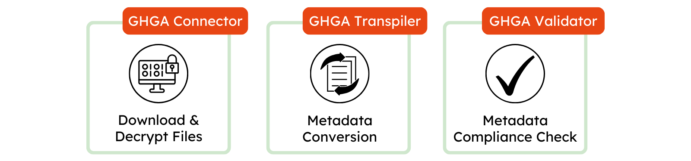

# Overview

The GHGA CLI (command-line interface) tools provide command-line utilities and Python libraries to facilitate interaction with GHGA's data infrastructure. These tools support tasks such as securely downloading encrypted files, converting metadata formats, and validating metadata.

## Available Tools:

  { width="800" }

- [GHGA Connector](https://docs.ghga.de/cli_tools/connector/) – Securely download and decrypt files from the GHGA infrastructure.
- [GHGA Transpiler](https://docs.ghga.de/cli_tools/transpiler/) – Convert metadata from XLSX spreadsheets into JSON format, ensuring compatibility with GHGA systems.
- [GHGA Validator](https://docs.ghga.de/cli_tools/validator/) – Validate metadata against the GHGA Metadata Model and generate a compliance report.
