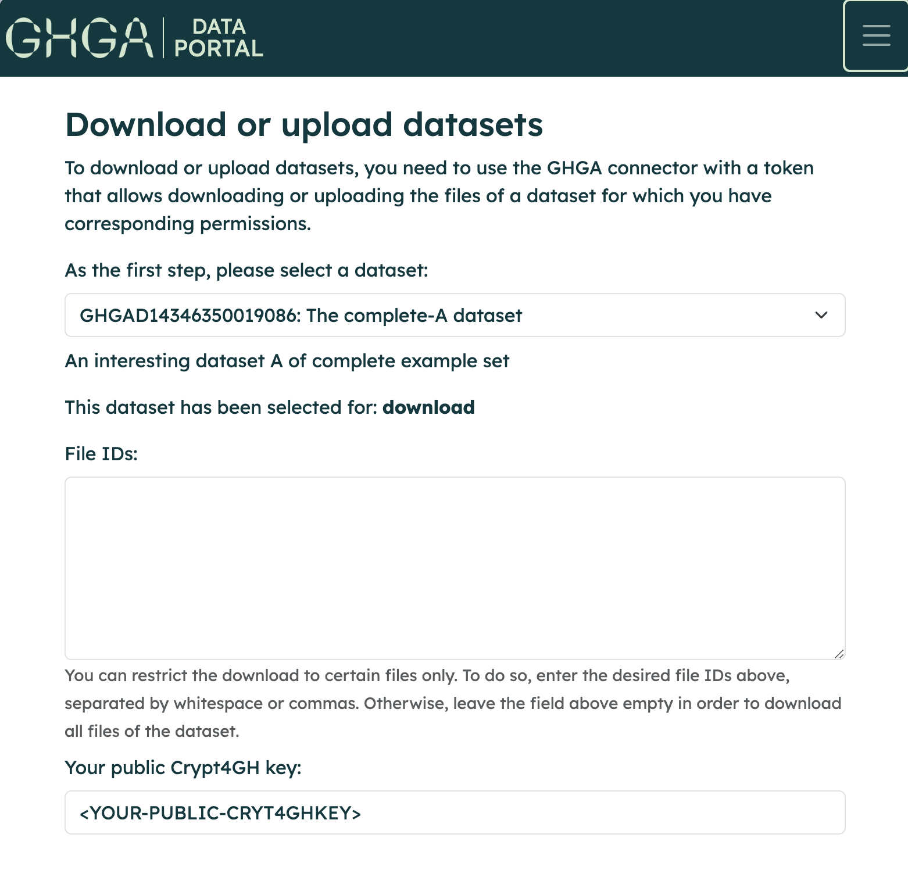

# Data Download

Downloading data from datasets you have been granted access to is a two stage process:

* The download is prepared through the *Data Portal*. The corresponding dataset
  is selected and the download potentially restricted to individual files from
  the dataset. At the end of this process, a download token is generated and
  shown to the user.

* Subsequently, the CLI tool [GHGA Connector](../cli_tools/connector.md) is used
  to perform the actual file download using the previously generated download
  token and the user's Crypt4GH key pair.

## Prerequisites

To perform a file download from GHGA, users are required to have genreated a
Crypt4GH keypair. The public key will be used to encrypt both the download token
and the actual files that are downloaded. For information on how to generate a
Crypt4GH keypair please refer to the official [Crypt4GH
documentation](https://crypt4gh.readthedocs.io/en/latest/).

## Download Preparation

After a user has been granted access to a dataset, the user initiates a data
download by creating a download token in the Data Portal. A single download
token can be generated to download either a single or multiple files from a
dataset. The download token is then passed on to the CLI tool GHGA Connector to
perform the actual download.

1. Navigate to the [GHGA Data Portal](https://data.staging.ghga.dev/download).

2. Visit your profile page to see the datasets you have access to.

    { width="500" }

3. Navigate to the dataset list and select your dataset of interest to be downloaded.

    { width="500" }

4. Fill the form with the necessary information in order to create a download
token. Specifying one or multiple file IDs is optional, if not information is
provided the entire dataset will be downloaded. A Crypt4GH public key must be
provided before submitting the form.

    { width="500" }

## Download using GHGA Connector

The GHGA Connector is a command-line tool that facilitates interaction with the
file storage infrastructure of GHGA. Data downloading is carried out using the
GHGA Connector.

For further information on how to use the command-line tool, please refer to the
[GHGA Connector](../cli_tools/connector.md) documentation.