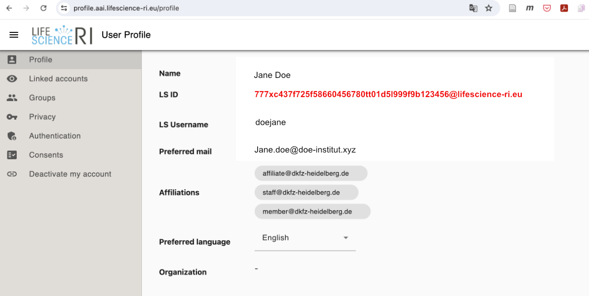

# Usage of LS-Login in the GHGA Data Portal

!!! info "Work in Progress"
   Contents in this page will be extended soon!

## General
For the usage of the services of the GHGA Data Portal, a Life Science Login / LS ID is necessary. Life Science Login is an authentication service from EOSC-Life, for details see [lifescience-ri.eu/ls-login/](https://lifescience-ri.eu/ls-login/).

# Specification of LS IDs in  Usage of LS ID in GHGA
To be able to processing [Data Processing Contracts](../glossary/glossary.md#data-processing-contract-dpc) and for others uses, GHGA users need to specify details of their LS ID to GHGA. The following information is needed:

| Field | Explanation  |
|---|---|
|Name| The name of the person, e.g. `Doe, Jane` |
|Organisation| Name of the Organization / Institution that interacts with GHGA, e.g. `Doe Institut`|
|Role| Your role in the Organisation, e.g. `Data Steward` |
|Contact Information| An email adress, e.g. `Jane.doe@doe-institut.xyz`|
|Life Science Login ID / LS ID | The LS ID e.g. as displayed in your user profile on https://profile.aai.lifescience-ri.eu/profile, e.g. `777xc437f725f58660456780tt01d5l999f9b123456@lifescience-ri.eu`. See screenshot below.  |

