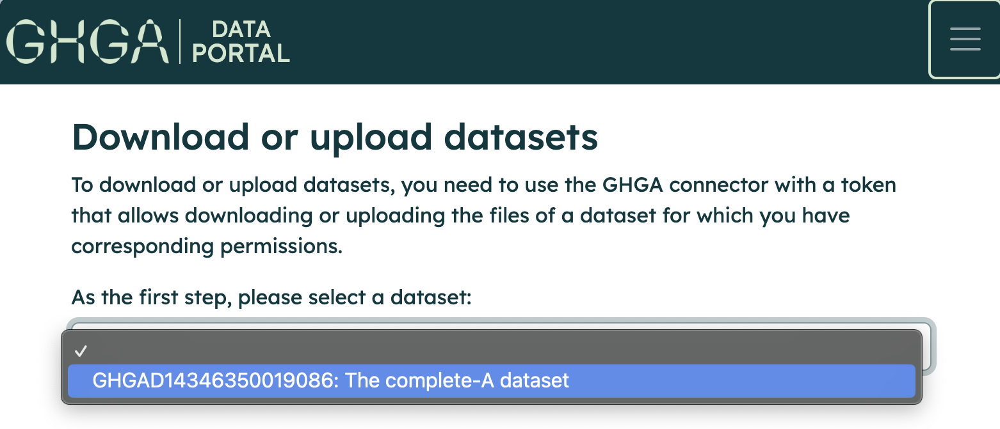

# Access Data and Download

## Getting access to data

The GHGA Data Portal enables users to request access to data through the portal. Browse for your dataset of interest and then click on the "Request Access" button. This will direct you to a data access request form. Complete the form with the necessary information and submit it to request access to the dataset. The data access committee will review your request and respond accordingly.

For further details on how to access data, please read the instructions on the [GHGA Data Portal](https://data.staging.ghga.dev/download).

## Create a download token

After a user has been granted access to a dataset of interest, the user utilizes the CLI tool GHGA Connector to perform the download. In order to do this users have to create a download token to authenticate and process the request against GHGA Central. Each download request is represented by a download token, which can be created via the GHGA Data Portal.

1. Navigate to the [GHGA Data Portal](https://data.staging.ghga.dev/download).

2. Visit your profile page to see the datasets you have access.

    { width="500" }

3. Navigate to the dataset list and select your dataset of interest to be downloaded.

    { width="500" }

4. Fill the form with necessary information in order to create a download token.

    { width="500" }

### Crypt4gh Keys

Download process requires your [Crypt4GH](https://crypt4gh.readthedocs.io/en/latest/) keys to encrypt downloaded data, ensuring that only you can access it. Please create a pair of Crypt4GH keys if you don't already have one.

Please paste your *public* Crypt4GH key to the related input box during the token creation.

## Download using GHGA Connector

The GHGA Connector is a command-line tool that facilitates interaction with the file storage infrastructure of GHGA. Data downloading is carried out using the GHGA Connector. You are expected to install the command-line tool and configure it accordingly. To execute a download, you will need the download token and a Crypt4GH key pair.

For further information on how to use the command-line tool, please read the [GHGA Connector](../connector/connector.md) document.