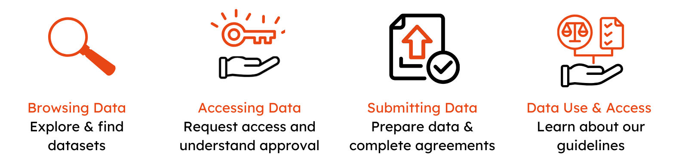

# GHGA User Documentation

Welcome to the GHGA User Documentation. On these pages you will find relevant information on services provided by [GHGA - the German Human Genome-Phenome Archive](https://www.ghga.de). 

--8<-- "submission_limitations.md"

## Getting Started - User Stories
The GHGA Data Portal supports researchers in browsing, accessing, and submitting human omics data under controlled access. This section provides step-by-step guidance for different user stories.

  { width="800" }

1. [Browsing Data](user_stories/browsing_data.md) – Search and filter available datasets to find relevant research data. Learn how to navigate the GHGA Data Portal efficiently.
1. [Accessing Data](user_stories/accessing_data.md) – Follow this step-by-step process to request dataset access, including login requirements and approval workflows.
1. [Submitting Data](user_stories/submission/submitting_data.md) – Understand the submission process, including metadata preparation, file uploads, and necessary legal agreements.
1. [Data Use & Access Guide](user_stories/dua-guideline.md) – Learn about suggested ethical standards, decision-making criteria, and policies for handling access requests.

## GHGA Terms of Use

The [**GHGA Terms of Use**](https://doi.org/10.5281/zenodo.11146387)  define the services offered by the GHGA Consortium and the performance levels of those services that users can expect. They also define the conditions that apply to users when using GHGA.

## Contact
Please reach out to the [GHGA Helpdesk](mailto:helpdesk@ghga.de) for any questions on GHGA.

!!! info "Funding"
    The <general:GHGA Consortium> is not an independent legal entity but an association of research institutions from all over Germany. It is funded by the Deutsche Forschungsgemeinschaft (DFG, German Research Foundation) as part of  GHGA – The German Human Genome-Phenome Archive (www.ghga.de, Grant Number [441914366](https://gepris.dfg.de/gepris/projekt/441914366?context=projekt&task=showDetail&id=441914366&) (NFDI 1/1)).