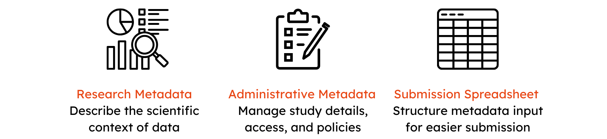

# **Captured Metadata**

  { width="800" }

- [Research Metadata](https://docs.ghga.de/metadata/entities/#research-metadata) – Covers metadata on individuals, samples, experiments, and analyses, including biospecimens, experimental methods, and analytical workflows used to generate the data.
- [Administrative Metadata](https://docs.ghga.de/metadata/entities/#administrative-metadata) – Manages data governance, access, and study details, defining datasets, access policies, responsible committees, and linked publications.
- [Submission Spreadsheet](https://docs.ghga.de/metadata/entities/#submission-spreadsheet) – Provides a structured format for metadata submission, ensuring consistency and completeness across all metadata categories.

A breakdown of each metadata element described in the different entities will provide more insight on what elements are required for the functionality of GHGA, mandatory properties and recommended or optional information that can be provided by the data submitters.

## **Research Metadata**

The Research Metadata focuses on the reusability and FAIRness of the data. The Research Metadata encapsulates a set of classes that shape the model in accordance to the performed experiment ensuring reproducibility and scalability. The classes include *Individual*, *Biospecimen/Sample*, *Experiment*, *Experiment Method*, *Analysis* and *Analysis Method*.

### **Individual**

The *Individual* entity collects non-personal metadata about the *Individual* from which the samples were collected. The content of the *Individual* entity is crucial to identify cohorts of interest and gives valuable insight on the target group of an experiment. 

#### **Individual metadata properties**

In order to describe an *Individual*, data submitters are required to provide information about sex and are recommended to provide information about phenotypic features and diagnoses. Additional information about the geographical region and ancestries can also be provided.

The Individual entity is linked to the *Sample* entity.

### **Individual Supporting File**

If the data submitters have additional information to provide about the *Individual*, then they can make use of the *Individual Supporting File* class. 

#### **Individual Supporting File metadata properties**
The **Individual Supporting File** requires the following information: file format, file name, dataset associated with this file as well as if the file is included as part of the submission.

### **Sample**

The *Sample* describes the extracted sample and tissue for an experimental process. Furthermore, the *Sample* is defined as a limited quantity of something to be used for testing, analysis, inspection, investigation, demonstration, or trial use. A sample is prepared from a biospecimen (isolate or tissue). The *Sample* entity includes slots describing the *Biospecimen* from which the sample was prepared, which are highlighted with a "*biospecimen_*" -prefix. The *Biospecimen* is defined as any natural material taken from a biological entity for testing, diagnostics, treatment or research purposes.

The *Sample* is linked to the *Individual* entity describing the collection of biological material. Further, it is linked to the *Experiment*.

#### **Sample metadata properties**

The *Sample* entity requires data submitters to provide the name, description, whether the sample is case or control, as well as the alias to the *Individual* from which the *Sample* was derived. In addition to the mandatory information, the data submitter is recommended to provide information about the storage, whether the sample can be classified as  diseased or healthy, and biological replicate information. Other optional fields include the type of the sample and an EGA accession ID. 

To further describe the *Biospecimen* from which the sample was prepared, data submitters are required to provide information about the age of the individual at the time of sampling and the biospecimen tissue. The recommended properties include a name for the biospecimen, its type, the vital status of the individual at the time of sampling, and the biospecimen isolation and storage.

### **Experiment**

An *Experiment* is an investigation that consists of a coordinated set of actions and observations designed to generate data with the goal of verifying, falsifying, or establishing the validity of a hypothesis. The *Experiment* entity describes the experimental setup or a protocol used for performing an omics experiment. 

The *Experiment* entity is linked to the *Sample* which implies one or more samples associated with this Experiment and the *Experiment Method* which implies one or more experiment methods associated with this Experiment. The outcome of an *Experiment* results in *Research Data File*.

#### **Experiment metadata properties**

The *Experiment* entity requires the data submitters to provide information about experiment method, title, description and sample information.

### **Experiment Method**

The *Experiment Method* entity captures information about the protocol that was followed to perform the omics experiment.

#### **Experiment Method metadata properties**

The data submitter is required to provide information about the name, description, library type, selection methods, preparation, the instrument model and sequencing layout to fulfil the *Experiment Method* pertaining to an omics experiment. Furthermore, it is recommended to provide information about the library preparation kit name and manufacturer, the primer, end bias, flow cell ID and type, rna seq strandedness, sample barcode read and sequencing center. The optional properties include target region, target coverage and EGA accession ID.

### **Experiment Method Supporting File**

Any additional information pertaining to the *Experiment Method* can be provided as *Experiment Method Supporting File*. 

#### **Experiment Method Supporting File metadata properties**
The submitter is required to provide information about the file format, the *Experiment Method* this file supports, the file name, the *Dataset* associated with this file and whether this file is included as part of the submission.

### **Research Data File**

The *Research Data File* entity is generated as a result of a direct measurement or sequencing of a sample. They are the raw files that were generated while carrying out an *Experiment*. This entity is linked to the *Experiment* that produced this file as well as the *Dataset* that is associated with this file. The GHGA metadata model emphasizes on the submission of a *Research Data File* alone or accompanied by *Process Data Files* for enabling reconstruction of the analytical process representing a submission.

#### **Research Data File metadata properties**

The *Research Data File* entity requires a data submitter to provide information about the file format, technical replicate, the *Experiment* that generated this *Research Data File*, the file name, the *Dataset* and whether the file is included in the submission. It is also recommended to provide information about the sequencing lane. The EGA accession ID is an optional property.

### **Analysis**

The *Analysis* entity permutates a *Research Data File* into a *Process Data File* through a computational workflow. 

The *Analysis* entity is linked to *Experiment* via *Research Data File* and also linked to *Analysis Method*.

#### **Analysis metadata properties**

The data submitter is required to provide information about the *Analysis* title, the *Analysis Method* that is associated with this *Analysis* and the *Research Data Files* that this *Analysis* used as input to generate *Process Data Files*.

### **Analysis Method**

The *Analysis Method* entity describes the computational workflow that created *Process Data Files* in more detail. 

#### **Analysis Method metadata properties**

For this submission, the data submitter is required to provide information about the *Analysis Method* name, a description, type, the workflow name, workflow repository and workflow DOI. Furthermore, it is also recommended to provide information about the workflow version, workflow tasks, parameters and software versions.

### **Analysis Method Supporting File**

For any additional information pertaining to the *Analysis Method* entity, the data submitter can use the *Analysis Method Supporting File*.

#### **Analysis Method Supporting File properties**

For supporting information about the *Analysis Method*, the data submitter is required to provide information about the file format, the *Analysis Method* this file supports, the file name, and the *Dataset* associated with this file.

### **Process Data File**

The *Process Data File* entity is a generated outcome of an analysis, alignment or  processing of a *Research Data File*. The *Process Data File* entity is linked to the *Dataset* that is associated with the file and the *Analysis* that produced this *Process Data File*.

#### **Process Data File metadata properties**

The *Process Data File* entity requires the data submitter to provide information about the file format, the *Analysis* from which this file originated, the file name, and the *Dataset*. Additionally, it is also possible to submit an optional EGA accession ID.

The submission process allows submission of processed data file alone but this is discouraged as it requires creation of empty Experiment class.

## **Administrative Metadata**

The Administrative Metadata focuses on managing the resources such as creation or acquisition of the data, rights management, and disposition. 

### **Dataset**

GHGA presents its content to potential data requesters and submitters with the *Dataset* entity, which focuses on sharing functionality by describing the contents at a high level. Each *Dataset* is linked to a *Data Access Policy*, which builds the legal basis for the sharing of data. One *Dataset* has links to *Experiment* via *Research Data File*, and to  *Analysis* via *Process Data File*. The *Dataset* is also indirectly linked to *Analysis Method*, *Experiment Method* and the *Individual* via *Analysis Method Supporing File*, *Experiment Method Supporing File* and *Individual Supporting File*, respectively. The *Dataset* entity is also linked to *Study*.

#### **Dataset metadata properties**

The *Dataset* entity is aimed at capturing relevant information about a dataset itself. The mandatory information required for *Dataset* entity includes title, description, type, the *Data Access Policy* that regulates this *Dataset* and the *Study*. Optionally, the data submitter could also provide information about an EGA accession.

### **Data Access Policy and Committee**

Depositing data at GHGA requires a data submitter to provide a *Data Access Committee (DAC)* and *Data Access Policy (DAP)*. This ensures controlled access to their deposited data and a clear guideline for data requesters to access the data. This includes a defined contact person and a consent-based legal basis for getting access to a dataset. The *DAP* entity is linked to *Dataset* and *DAC*.

#### **DAP and DAC metadata properties**

A *DAP* is directly linked to the *DAC* and *Dataset* entity, thus providing  the condition under which the data deposited at GHGA can be re-used by a data requester. The submitter must provide an alias, name, description and either the policy text for the *DAP* or the URL where the *DAP* is stored, data use permission and modifier using the Data Use Ontology, and the *DAC* that governs this *DAP*.

A *DAC* is linked directly to *DAP* and requires information about the DAC email and institute and optionally about an EGA accession.

### **Study**

All data deposited at GHGA is subject to a specific study, under which relevant data has been aggregated. A *Study* is an experimental investigation of a particular phenomenon and involves a detailed examination and analysis of a subject to learn more about the phenomenon being studied. A detailed description of a study can guide data requesters to identify the most relevant datasets for their own research.  The *Study* entity is linked to *Dataset* and optionally to *Publication*.

#### **Study metadata properties**

In order to describe a *Study*, data submitters are required to provide information about the study affiliation(s), the title, a description and the study type. Optionally, they can provide an EGA accession ID.

### **Publication**

The *Publication* entity refers to a journal article, book, or conference paper that presents original research or scholarly findings in a specific field of study, contributing to the collective knowledge and understanding of that discipline. 

The *Publication* entity is linked to *Study*.

#### **Publication metadata properties**

The data submitter is required to provide information about the *Study* associated with this publication. Optionally, the data submitter can also provide information about the publication title, abstract, author, year, journal and DOI.

## **Submission Spreadsheet**

The Submission Spreadsheet for GHGA Archive captures the above-mentioned metadata in an ordered fashion. The submission process is tailored to replicate a “front-to-end” workflow:

- Which individuals are subject to investigation?
- Which biological material was collected and how?
- Which experiment was performed and how? Which files were generated as result?
- Which analysis was performed and how? Which output files were generated from which input files?
- How can this data be shared in meaningful datasets? Which conditions apply and who governs them?

The submitter can also make use of the supporting files to enrich their data with additional information, such as experimental protocols for the *Experiment* class or workflow parameter files for the *Analysis* class. The supporting files can contain structured metadata, such as Phenopackets or PED files for the *Individual* class. Since supplementary files are encrypted and inaccessible without DAC approval, this allows submissions of clinical or personal metadata that can only be accessed by requesters after signing a Data Transfer Agreement. Hence, the metadata model can only indicate the presence of supplementary files for classes and signify that a submission contains additional information but not process their content.
This results in a submission process, which will appear much more natural to submitters, while maintaining a high degree of flexibility to adapt to different omics types.

