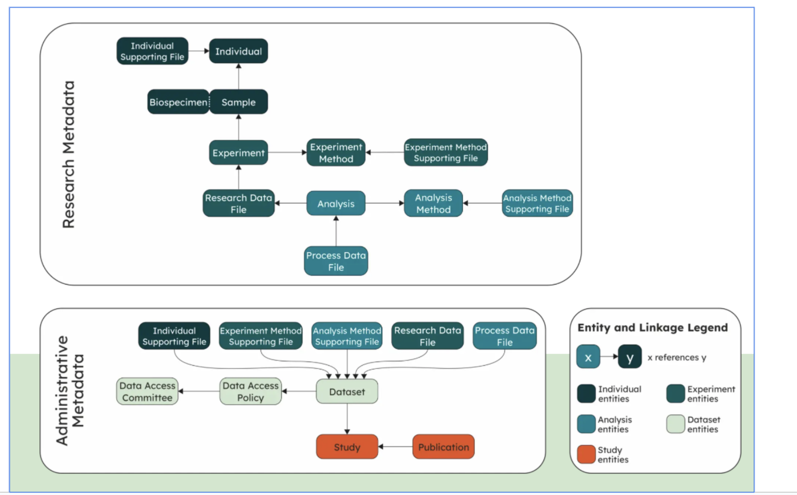

# The GHGA Metadata Model

The GHGA metadata model aims at facilitating  comprehensive submissions that maximize the amount of collected metadata without creating friction on the submitter side, enabling (reusable) submissions of different types of -omics data into GHGA.  The schema consists of **Research Metadata** and the **Administrative Metadata**. The **Research Metadata** aims at maximising the reusability and FAIRness of the data and the  **Administrative Metadata** focuses on managing the resources, such as creation or acquisition of the data, rights management, and disposition. The schema also differentiates between file types depending on whether they were generated through primary analysis (**Research Data File**), secondary analysis (**Process Data File**) or supplementary information to the classes (**Supporting File**) 

The GHGA metadata model follows several internationally renowned concepts, standards, and resources to provide a metadata schema to share data in a standardized and harmonized fashion. Please visit (https://zenodo.org/records/8341224) for further details.

