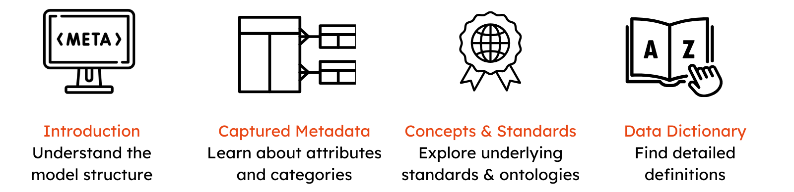

# The GHGA Metadata Model

The GHGA Metadata Model provides a structured approach to organising human omics data, ensuring FAIR principles (Findable, Accessible, Interoperable, Reusable) for data archiving and sharing. This documentation offers in-depth explanations of the metadata model, including its structure, captured metadata, standards, and ontologies.

## Key Components: 

  { width="800" }

1. [Introduction](https://docs.ghga.de/metadata/overview/#introduction) – Understand the general structure of the metadata model and how it supports data submission and retrieval.
2. [Captured Metadata](https://docs.ghga.de/metadata/entities/) – Learn about types of metadata captured in our model, including research and administrative metadata attributes.
3. [Concepts & Standards](https://docs.ghga.de/metadata/standards/) – Read about the internationally recognised standards and ontologies for interoperability and data harmonisation on which the GHGA metadata model is based.
4. [Data Dictionary](https://docs.ghga.de/metadata/data_dictionary/ad_overview/) - Find detailed definitions of metadata terms used in the GHGA schema.

## Glossary

- **Entity**: An Entity holds characteristics of a real-world object. Example: The Individual entity is described by the information (properties) for sex, year of birth and height.

    - Synonyms: class, table, object

- **Property**: A Property is a single characteristic that can be used in combination with other characteristics to describe a real-world object. Example: The combination of the properties sex, year of birth and height describe the (real-world object) entity Individual.

    - Synonyms: attribute, element, field, slot

- **FAIR**: Findable, Accessible, Interoperable, Reusable

## Introduction
The German Human Genome-Phenome Archive (GHGA) provides a nation-wide resource for archiving, accessing and sharing of multi-omics data produced and processed in research and health care initiatives in Germany. GHGA aims to bring these data together and make it easier to find data for secondary use, by adopting and adhering to [FAIR data principles](https://doi.org/10.1038/sdata.2016.18). In order to meet the domain-specific requirements we developed the GHGA Metadata Schema - a schema for representing information pertaining to various aspects of our data.

This documentation serves as the description and reasoning behind the Metadata Model of GHGA, which encapsulates the metadata schema, its technical implementation, and resources to support submission of metadata. The Archive function of GHGA is envisioned to handle a wide variety of omics and research data. The GHGA metadata model aims at facilitating  comprehensive submissions that maximize the amount of collected metadata without creating friction on the submitter side, enabling (reusable) submissions of different types of -omics data into GHGA. This metadata model can satisfy the heterogeneous needs of submitters while maintaining the FAIR principles, interoperability with EGA and facilitating streamlined user journeys.

Classes in the schema can be grouped into **Research Metadata** and **Administrative Metadata** based on the information they capture. The **Research Metadata** aims at maximising the reusability and FAIRness of the data, while the **Administrative Metadata** focuses on managing the resources, such as creation or acquisition of the data, rights management, and disposition. The Research Metadata classes include *Individual*, *Biospcimen/Sample*, *Experiment*, *Experiment Method*, *Analysis* and *Analysis Method*. The Administrative Metadata captures *Dataset*, *Data Access Policy*, *Data Access Committee*, *Publication*, and *Study*.  

The model also differentiates between three file types:

- **Research Data File**: A file which results from the omics experiment, such as sequencing of a sample.
- **Process Data File**: A file that is generated as output from an analysis performed on a *Research Data File*, such as alignment or processing.
- **Supporting File**: A file that provides further information about an *Individual*, *Experiment Method* or *Analysis Method*. These could be unstructured protocols or structured information, such as Phenopackets or BioCompute Objects.

Furthermore we provide data submitters with a Submission Spreadsheet in order to easily deposit their data within GHGA.