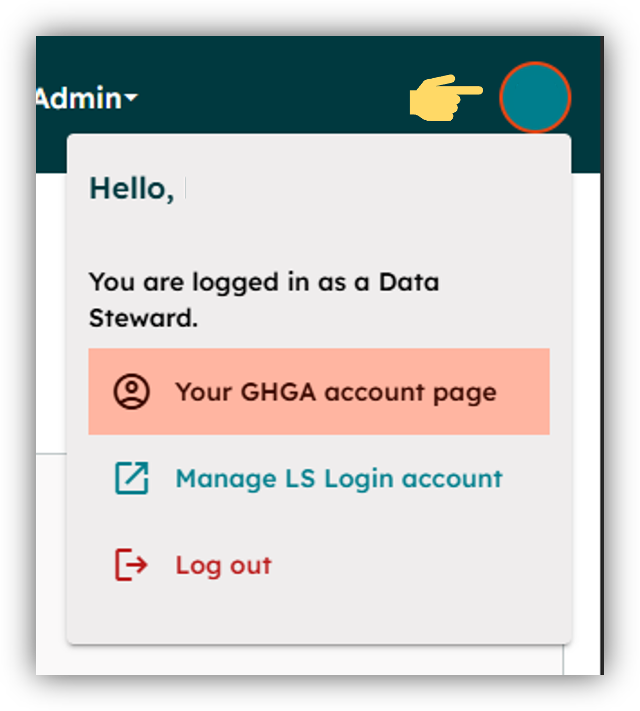
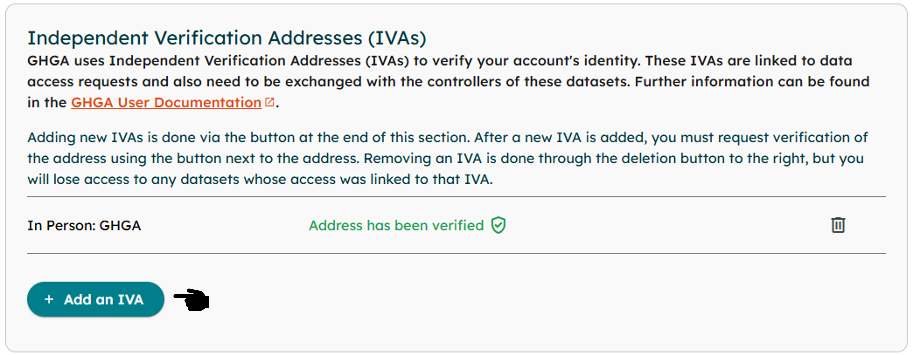
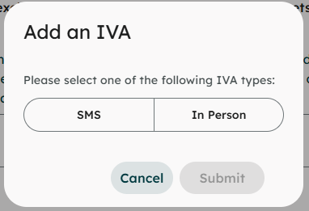
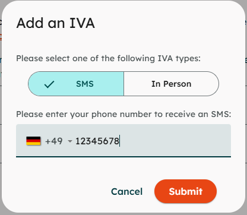
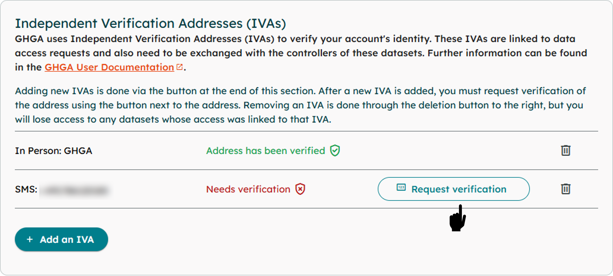
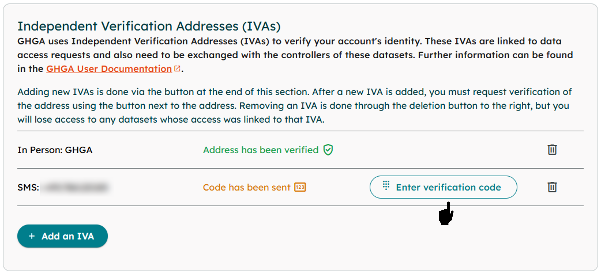

# The Independent Verification Address (IVA) and how it is used in GHGA

## What Is an IVA?

An **<general:Independent Verification Address (IVA)>** is an alternative contact method (usually a mobile phone number) used to verify personal accounts in the GHGA Data Portal. It aims to ensure that the <general:LS ID> used for authorisation in the portal is not compromised, thereby implementing an additional security layer. An IVA is also used by GHGA Data Stewards to validate decisions on <general:Data Access Request (DAR)|Data Access Requests> that are communicated to GHGA by <general:Research Data Controller Representative (RDCR)|Research Data Controller Representatives>.

IVAs must be able to receive a **one-time verification code** via SMS, and so normally a mobile phone number is used.

## Why Is an IVA Needed?

IVAs are an additional safety measure used to identify individuals either when they communicate with GHGA or during communication of the <general:Research Data Controller (RDC)|Research Data Controllers> with <general:Data Requester (DR)|Data Requesters>. 

An IVA is needed during the following processes:

1. **Data Submission to GHGA:** During the establishment of a <general:Data Processing Contract (DPC)> with <general:GHGA Central> the Data Submitter must specify IVAs for the Persons authorised to act on behalf of the <general: Research Data Controller (RDC)> in the DPC. *Further information [here](../user_stories/submission/dpc_preparation.md#annex-4-persons-authorised-to-act).*
2. **Making a Data Access Request:** When filing a <general:Data Access Request (DAR)> to a study listed on GHGA, the <general:Data Requester Representative (DRR)> creates an account on the GHGA Portal. Initial authentication is done via <general:LS ID>. However, in order to be able to download data from an approved DAR, a verified IVA is needed. Importantly, the <general:Research Data Controller (RDC)|Research Data Controller> must instruct GHGA to use the same IVA for the DRR so we are sure that the Research Data Controller has verified the IVA independently. *Further information [here](../user_stories/accessing_data.md).*
3. **Negotiating a Data Transfer Agreement (DTA):** Once a <general:Data Access Request (DAR)> is filed in the GHGA Data Portal, it is the duty of the <general:Research Data Controller (RDC)|Research Data Controller> to negotiate a suitable <general:Data Transfer Agreement (DTA)> with the Data Requester. Importantly, GHGA is not involved in this process. During this negotiations, the controller needs to confirm the IVA provided by the Data Requester in order to ensure the identity of the data requester. *Further information [here](../user_stories/dua-guideline.md).*

## General Usage Instructions for the IVA

### How to Verify an IVA

 GHGA offers two types of IVAs:  Mobile Phones and in Person validation. A new IVA can be added to your profile in the [GHGA Data Portal](https://data.ghga.de/). 

*For practicability mobile phones are recommended but please note that <general:Research Data Controller (RDC)> might demand alternative means during negotiation of a <general:Data Transfer Agreement (DTA)>*.

1. To create and verify a contact navigate to the [GHGA Data Portal](https://data.ghga.de/).

2. After logging in, visit "Your GHGA account page" by clicking on your profile on the top right corner.
    { width="300" }

3. Here the menu "Independent Verification Addresses (IVAs)", lists all registered contact addresses. To add a new one, click "Add an IVA":

    { width="800" }

4. Select an IVA type from SMS, or In-Person. Please note, in person verification is only offered for personnel located at a GHGA Data Hub. The fastest verification can be performed via SMS.

    { width="800" }

5. Enter the required information for the chosen type and confirm them by clicking on "Submit".

    { width="800" }

6. The menu "Independent Verification Addresses (IVAs)" will add the unverified address. A code for this address can be requested by clicking "Request verification".

    { width="800" }

7. A code will be transmitted if "SMS" was selected. Upon receival of the code, click on "Enter verification code", enter the code and confirm the transmission. 

    { width="800" }

The contact address will then be shown as "Address has been verified".

If a code is not working or lost, the address can be deleted and added again to generate a new code. In case of issues, please contact the <general:GHGA Helpdesk>.

### Important Notes

* IVAs will never be shared publicly by GHGA.
* Only **verified IVAs** that have been approved by the Research Data Controller can be used for accessing data.
* If you **reset your second factor**, all IVAs require **re-verification**.
* An incorrect or unverified IVA will prevent you from downloading data.
* You can submit a Data Access Request without an IVA, but cannot download data until it’s verified.
