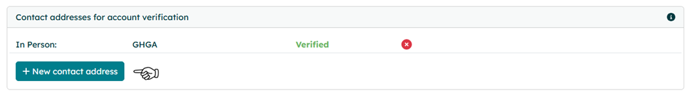

# The Independent Verification Address (IVA) and how it is used in GHGA

## What Is an IVA?

An **<general:Independent Verification Address (IVA)>** is an alternative contact method (usually a mobile phone number) used to verify personal accounts in the GHGA Data Portal. It aims to ensure that the <general:LS ID> used for authorisation in the portal is not compromised, thereby implementing an additional security layer. An IVA is also used by GHGA Data Stewards to validate decisions on <general:Data Access Request (DAR)|Data Access Requests> that are communicated to GHGA by <general:Research Data Controller Representative (RDCR)|Research Data Controller Representatives>.

IVAs must be able to receive a **one-time verification code** via SMS, and so normally a mobile phone number is used.

## Why Is an IVA Needed?

IVAs are an additional safety measure used to identify individuals either when they communicate with GHGA or during communication of the <general:Research Data Controller (RDC)|Research Data Controllers> with <general:Data Requester (DR)|Data Requesters>. 

An IVA is needed during the following processes:

1. **Data Submission to GHGA:** During the establishment of a <general:Data Processing Contract (DPC)> with <general:GHGA Central> the Data Submitter must specify IVAs for the Persons authorised to act on behalf of the <general: Research Data Controller (RDC)> in the DPC. *Further information [here](../user_stories/submission/dpc_preparation.md#annex-4-persons-authorised-to-act).*
2. **Making a Data Access Request:** When filing a <general:Data Access Request (DAR)> to a study listed on GHGA, the <general:Data Requester Representative (DRR)> creates an account on the GHGA Portal. Initial authentication is done via <general:LS ID>. However, in order to be able to download data from an approved DAR, a verified IVA is needed. Importantly, the <general:Research Data Controller (RDC)|Research Data Controller> must instruct GHGA to use the same IVA for the DRR so we are sure that the Research Data Controller has verified the IVA independently. *Further information [here](../user_stories/accessing_data.md).*
3. **Negotiating a Data Transfer Agreement (DTA):** Once a <general:Data Access Request (DAR)> is filed in the GHGA Data Portal, it is the duty of the <general:Research Data Controller (RDC)|Research Data Controller> to negotiate a suitable <general:Data Transfer Agreement (DTA)> with the Data Requester. Importantly, GHGA is not involved in this process. During this negotiations, the controller needs to confirm the IVA provided by the Data Requester in order to ensure the identity of the data requester. *Further information [here](../user_stories/dua-guideline.md).*

## General Usage Instructions for the IVA

### How to Verify an IVA

 GHGA offers multiple ways to add IVAs (Mobile Phones, Letter, in Person). A verification address can be added in the [GHGA Data Portal](https://data.ghga.de/). 

*For praticability mobile phones are recommened but please note that <general:Research Data Controller (RDC)> might demand alternative means during negotiation of a <general:Data Transfer Agreement (DTA)>*.

1. To create and verify a contact navigate to the [GHGA Data Portal](https://data.ghga.de/).

2. Visit your profile page to find the menu "Contact addresses for account verification", which lists all registered contact addresses. To add a new one, click "New Contact Address":

    { width="800" }

3. Select a contact address from SMS, Letter or In-Person. Please note, in person verification is only offered for personnel located at a GHGA Data Hub. The fastest verification can be performed via SMS.

    { width="800" }

4. Enter the contact information for the chosen address and confirm them by clicking "Add unverified contact address".

    { width="800" }

5. The menu "Contact addresses for account verification" will add the unverified address. A code for this address can be requested by clicking "Request verification".

    { width="800" }

6. A GHGA Data Steward will generate a code and transmit it via the chosen verification method. You will also be notified via mail when a code has been transmitted. Upon receival of the code, click enter verification code, enter the code and confirm the transmission. The contact address will then be shown as "Verified".

    { width="800" }

If a code is not working or lost, a Data Steward can generate a new one. In case of issues, please contact the <general:GHGA Helpdesk>.

### Important Notes

* IVAs will never be shared publicly by GHGA.
* Only **verified IVAs** that have been approved by the Research Data Controller can be used for accessing data.
* If you **reset your second factor**, all IVAs require **re-verification**.
* An incorrect or unverified IVA will prevent you from downloading data.
* You can submit a Data Access Request without an IVA, but cannot download data until it’s verified.
