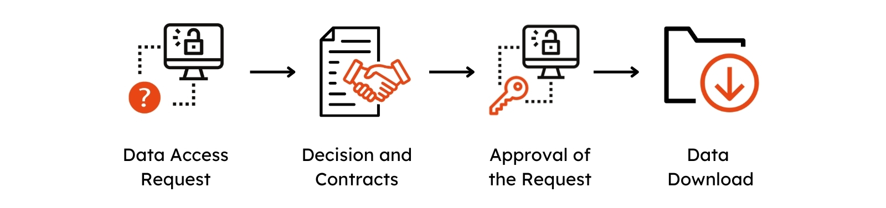
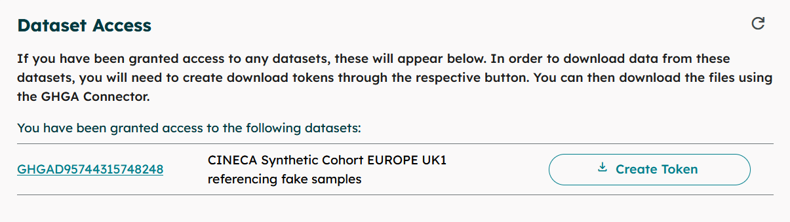
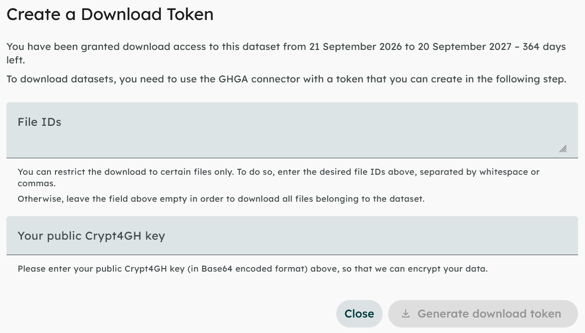

# Accessing Data

  { width="800" }

Getting access to a dataset on GHGA happens in four stages, shown above: you file a **Data Access Request**, the Research Data Controller's Data Access Committee handles the **Decision and Contracts** with you, GHGA then implements the **Approval of the Request**, and finally you perform the **Data Download**. Each stage is described in more detail below.

## Data Access Request

!!! note "Prerequisite"
    You need a <general:LS ID|Life Science Login or LS-Login> to log in to GHGA and create a Data Access Request.

1. Browse for your dataset of interest and click the "Request Access" button. This will direct you to a Data Access Request form.
2. Complete the form with the necessary information and submit your <general:Data Access Request (DAR)|Data Access Request>.
3. The request is sent to the <general:Research Data Controller (RDC)> for the dataset. GHGA is not involved in the further process of negotiating the data access.

We recommend setting up your <general:Independent Verification Address (IVA)> around the same time you submit your request, since you will need it in the next stage. See [Verifying Your Account](#verifying-your-account-with-an-iva) below.

### Tips for a Strong Request

A well-documented request helps the <general:Data Access Committee (DAC)> to assess it more quickly. When filling out the form, we recommend that you:

- Use an email address affiliated with your institution rather than a personal address, so the DAC can confirm your affiliation at a glance.
- State the institute or organisation you belong to.
- Include your position or role (e.g. PhD student, postdoc, group leader), so the DAC can assess your standing to conduct the proposed research.
- Use the request text to describe your research intent — what you plan to do with the data and why you need it — rather than a generic statement.

## Decision and Contracts

  { width="800" }

Your request is reviewed by a <general:Data Access Committee (DAC)> installed by the <general:Research Data Controller (RDC)|Research Data Controller>. The DAC checks your request against the dataset's data access policy and, if satisfied, negotiates a <general:Data Transfer Agreement (DTA)> with you directly. As part of this negotiation, you need to share your verified <general:Independent Verification Address (IVA)> with the RDC so they can confirm your identity independently of GHGA.

!!! note "Responsibilities for handling of Data Access Requests"
    GHGA is not responsible for deciding on Data Access Requests — this is the responsibility of the DAC. Processing times vary between Research Data Controllers. If you do not receive a decision on your request within a reasonable time, please reach out to the GHGA Helpdesk or the DAC as indicated on the [dataset details page](../user_stories/browsing_data.md#dataset-details).

For a closer look at how DACs are expected to review requests and negotiate DTAs, see the [Data Use and Access Guide](dua-guideline.md).

## Approval of the Request

Once the RDC has approved your request and a DTA is in place, the RDC instructs GHGA to implement the approval for your account. GHGA only shares data with accounts that are verified with the same IVA the RDC confirmed during the negotiation.

### Verifying Your Account with an IVA

As an additional layer of safety, download tokens can only be generated by accounts that have at least one verified <general:Independent Verification Address (IVA)> registered.

- Details on how to set up and verify an IVA are described [here](../other/iva.md).

## Data Download

Downloading data from datasets you have been granted access to is a two stage process:

* The download is prepared through the *Data Portal*. The corresponding dataset
  is selected and the download potentially restricted to individual files from
  the dataset. At the end of this process, a download token is generated and
  shown to the user.

* Subsequently, the CLI tool [GHGA Connector](../cli_tools/connector.md) is used
  to perform the actual file download using the previously generated download
  token and the user's Crypt4GH key pair.

### Prerequisites

To perform a file download from GHGA, users are required to have generated a
Crypt4GH keypair. The public key will be used to encrypt both the download token
and the actual files that are downloaded. For information on how to generate a
Crypt4GH keypair please refer to the official [Crypt4GH
documentation](https://crypt4gh.readthedocs.io/latest/).

### Download Preparation

After a user has been granted access to a dataset, the user initiates a data
download by creating a download token in the Data Portal. A single download
token can be generated to download either a single or multiple files from a
dataset. The download token is then passed on to the CLI tool GHGA Connector to
perform the actual download.

1. Navigate to the [GHGA Data Portal](https://data.ghga.de/).

2. Visit your profile page to see the datasets you have access to.

3. Navigate to the dataset list and select your dataset of interest to be downloaded by clicking on "Create Token".

    { width="800" }

4. Fill the form with the necessary information in order to create a download
token. Specifying one or multiple file IDs is optional, if none are entered the entire dataset will be downloaded. A Crypt4GH public key must be
provided before submitting the form.

    { width="800" }

    !!! tip "Access period"
        The token creation form also shows the time window for which your access to the dataset is valid, so you can see at a glance how long you have left to download the data.

### Download using GHGA Connector

The GHGA Connector is a command-line tool that facilitates interaction with the
file storage infrastructure of GHGA. Data downloading is carried out using the
GHGA Connector.

For further information on how to use the command-line tool, please refer to the
[GHGA Connector](../cli_tools/connector.md) documentation.
