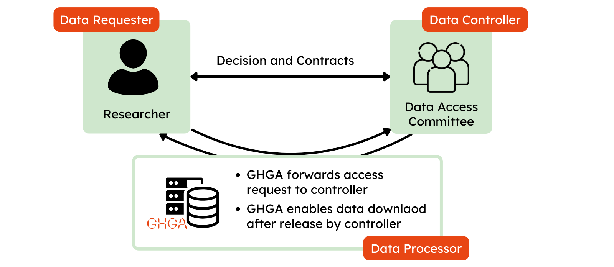

# Accessing Data
## Creating a Data Access Request

  { width="800" }

 - The GHGA Data Portal enables users to request access to data through the portal.
 - For creating a <general:Data Access Request (DAR)> you need to have a Life Science Login / LS ID. See [here](ls-login.md) for further information on this.
 - Browse for your dataset of interest and then click on the "Request Access" button. This will direct you to a data access request form. 
 - Complete the form with the necessary information and submit your <general:Data Access Request (DAR)|Data Access Request>. 
 - The data access request will be sent to the <general:Research Data Controller (RDC)>, who will will review your request and respond accordingly. Please note that GHGA is not involved in the further process of negotiating the data access.
 - To download a dataset, a valid contact address for account verification has to be set up in the user profile.

!!! note "Responsibilities for handling of data access requests"
    Please note the GHGA is not responsible for deciding of data access requests as this is a responsibility of <general:Data Access Committee (DAC)> installed by the the <general:Research Data Controller (RDC)|Research Data Controller>. In case you do not receive notifications about the decision on your request, please first contact the DAC as indicated on the [dataset details page](../user_stories/browsing_data.md#dataset-details)

  { width="800" }

## Account verification

As additional layer of safety, download tokens can only be generated by accounts that have at least one valid Contact Address registered. GHGA offers multiple ways to add verification addresses (SMS, Letter, in Person). A verification address can be added in the GHGA *Data Portal*

1. To create and verify a contact navigate to the [GHGA Data Portal](https://data.ghga.de/).

2. Visit your profile page to find the menu "Contact addresses for account verification", which lists all registered contact addresses. To add a new one, click "New Contact Address":

    { width="800" }

3. Select a contact address from SMS, Letter or In-Person. Please note, in person verification is only offered for personnel located at a GHGA Data Hub. The fastest verification can be performed via SMS.

    { width="800" }

4. Enter the contact information for the chosen address and confirm them by clicking "Add unverified contact address".

    { width="800" }

5. The menu "Contact addresses for account verification" will add the unverified address. A code for this address can be requested by clicking "Request verification".

    { width="800" }

6. A GHGA Data Steward will generate a code and transmit it via the chosen verification method. You will also be notified via mail when a code has been transmitted. Upon receival of the code, click enter verification code, enter the code and confirm the transmission. The contact address will then be shown as "Verified".

    { width="800" }

If a code is not working or lost, a Data Steward can generate a new one. In case of issues, please contact the <general:GHGA Helpdesk>.

## Data Download

Downloading data from datasets you have been granted access to is a two stage process:

* The download is prepared through the *Data Portal*. The corresponding dataset
  is selected and the download potentially restricted to individual files from
  the dataset. At the end of this process, a download token is generated and
  shown to the user.

* Subsequently, the CLI tool [GHGA Connector](../cli_tools/connector.md) is used
  to perform the actual file download using the previously generated download
  token and the user's Crypt4GH key pair.

### Prerequisites

To perform a file download from GHGA, users are required to have genreated a
Crypt4GH keypair. The public key will be used to encrypt both the download token
and the actual files that are downloaded. For information on how to generate a
Crypt4GH keypair please refer to the official [Crypt4GH
documentation](https://crypt4gh.readthedocs.io/en/latest/).

### Download Preparation

After a user has been granted access to a dataset, the user initiates a data
download by creating a download token in the Data Portal. A single download
token can be generated to download either a single or multiple files from a
dataset. The download token is then passed on to the CLI tool GHGA Connector to
perform the actual download.

1. Navigate to the [GHGA Data Portal](https://data.ghga.de/).

2. Visit your profile page to see the datasets you have access to.

    { width="500" }

3. Navigate to the dataset list and select your dataset of interest to be downloaded.

    { width="500" }

4. Fill the form with the necessary information in order to create a download
token. Specifying one or multiple file IDs is optional, if not information is
provided the entire dataset will be downloaded. A Crypt4GH public key must be
provided before submitting the form.

    { width="500" }

### Download using GHGA Connector

The GHGA Connector is a command-line tool that facilitates interaction with the
file storage infrastructure of GHGA. Data downloading is carried out using the
GHGA Connector.

For further information on how to use the command-line tool, please refer to the
[GHGA Connector](../cli_tools/connector.md) documentation.
