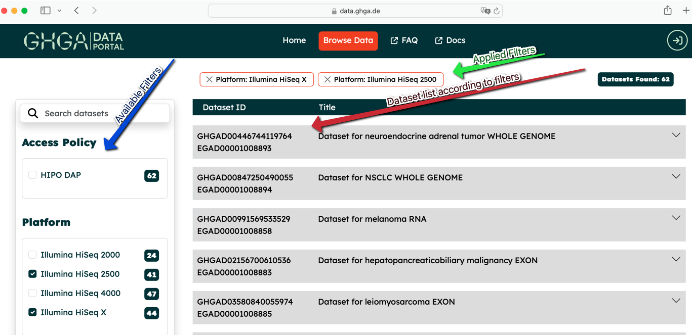
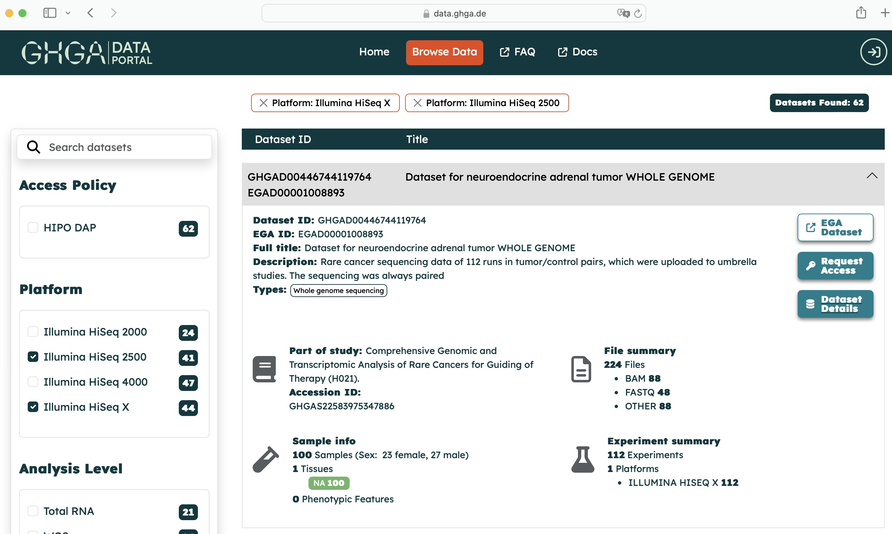
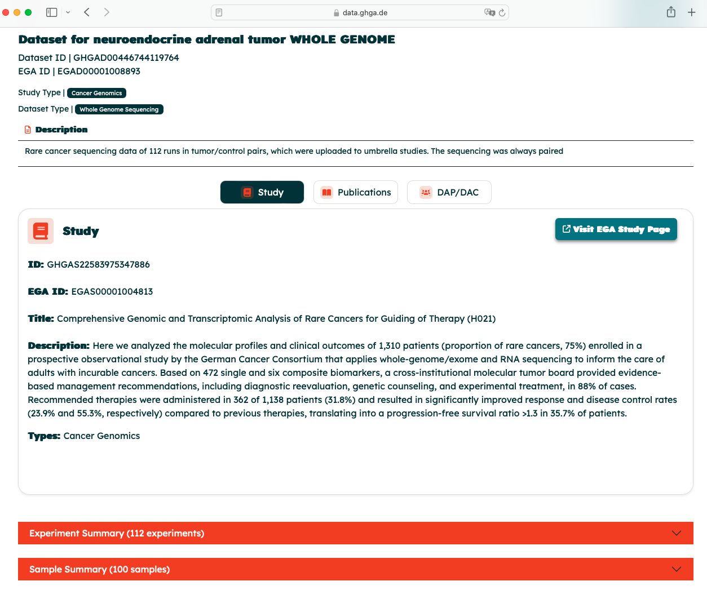

# Browsing Data

The GHGA Data Portal is a secure national infrastructure for human omics data available under controlled access. To browse data, please visit the GHGA Data Portal at [data.ghga.de/](https://data.ghga.de/) and go to the ["Browse" page.](https://data.ghga.de/browse).

## Views
### Overview
The first view shows you an overview of all available datasets on GHGA.

#### Filtering
- On the left various filter options are available to filter for desired properties of datasets.
    - Select filters and click "Filter" on the bottom left to apply the filters to the list of datasets shown on the right.
    - This will lead to fewer datasets shown in the listing on the right. Filters can be removed by just clicking the "x" on the applied filters on the top of the list.

    

#### Dataset details overview
- To see more details of a dataset, just click on the list item. An extended view of this dataset will appear:

- The following functionalities can be accessed from that page:
    - "EGA Dataset": In case the dataset is in addition listed on the [EGA-Archive](https://ega-archive.org/), this will open a new tab with the corresponding dataset detail page on EGA.
    - " Request Access": In case you would like to use this dataset, this button opens (after login) a form to request access to the dataset. See [Accessing Data](accessing_data.md) for further details.
    - "Dataset details" opens a detailed view of the dataset, see below.

### Dataset details
- Once you have clicked on the "Dataset details in the [Overview](#overview), you will be forwarded to the Dataset details view. This view contains further information on the datasets metadata e.g.:
    - Study description
    - Linked publications
    - Data Access Details
    - Experiment Summary
    - Sample Summary
    - File Summary
- Details on the nature of these fields are described in the [documentation on the Metadata Model](../metadata/overview.md) used.

