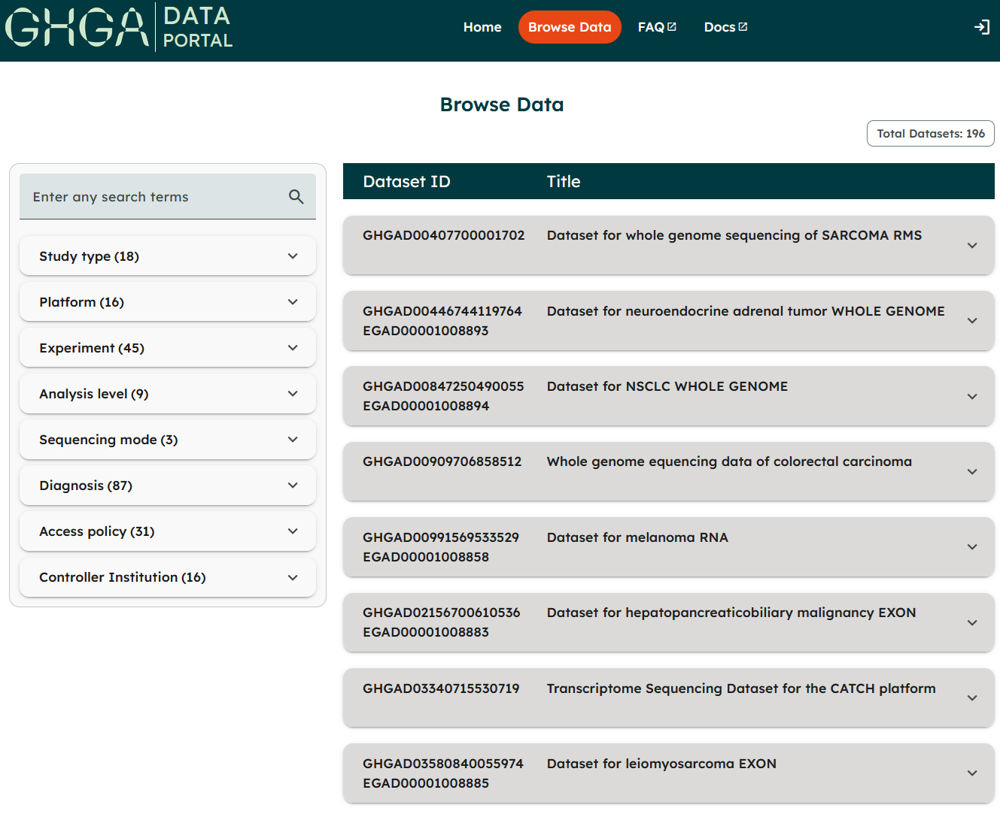
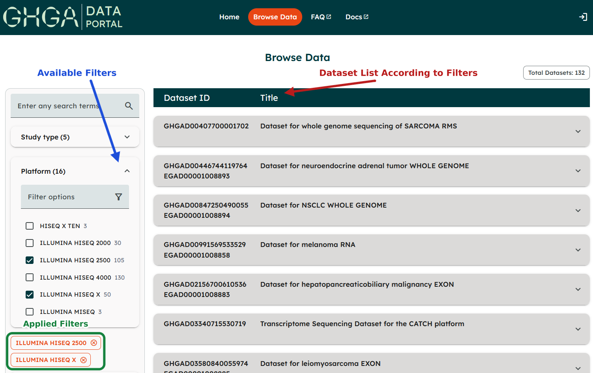
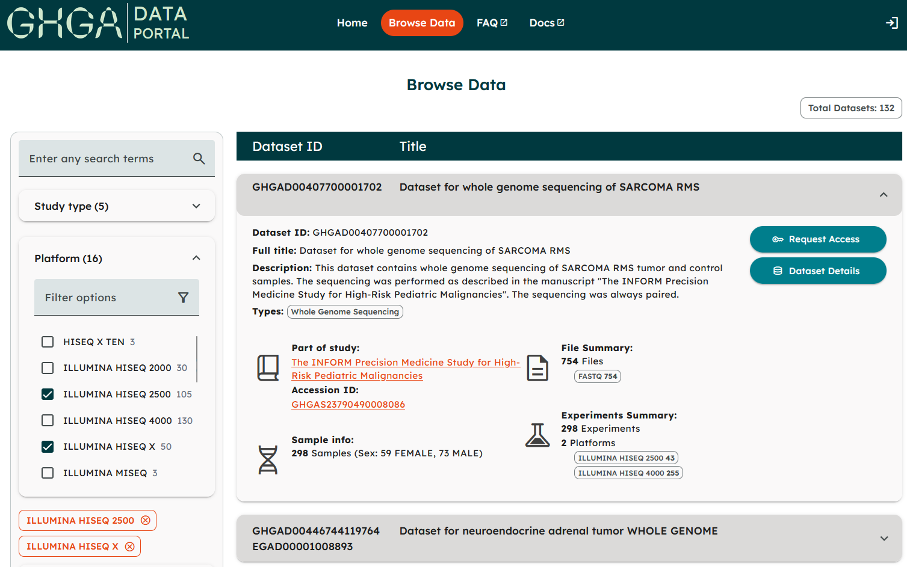
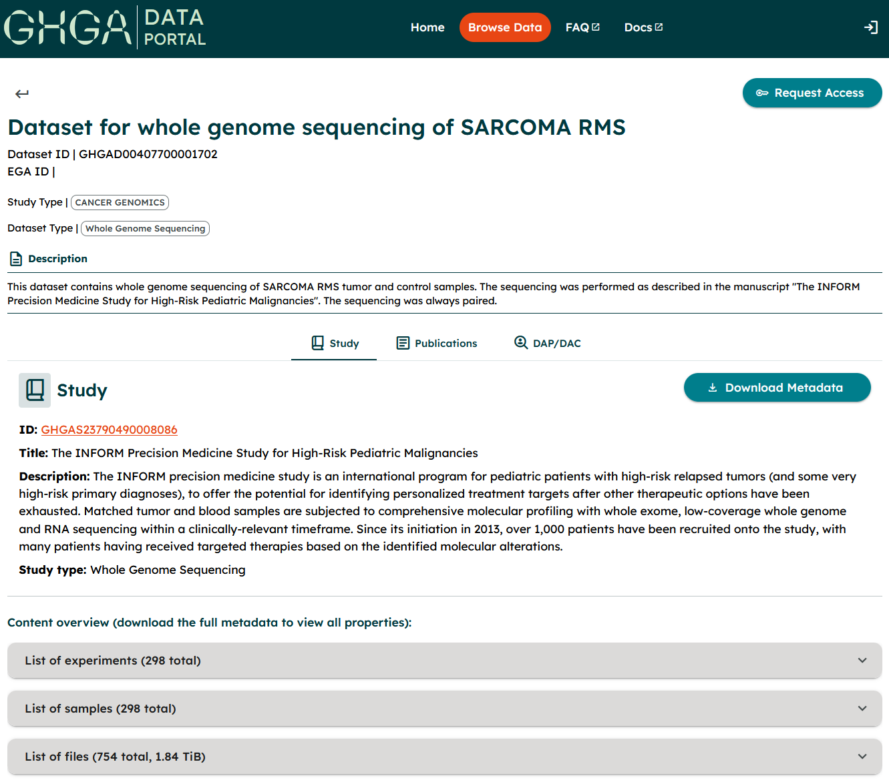

# Browsing Data

The GHGA Data Portal is a secure national infrastructure for human omics data available under controlled access. To browse data, please visit the GHGA Data Portal at [data.ghga.de](https://data.ghga.de/) and go to the ["Browse" page](https://data.ghga.de/browse).

!!! note "No account required"
    Browsing and searching datasets on the GHGA Data Portal is open to everyone and does not require a <general:LS ID|Life Science Login> or registration. An account is only needed once you want to [request access](accessing_data.md) to a dataset.

## Finding Datasets

The Browse page lists all datasets currently available on GHGA. Two complementary tools help you narrow this list down to the datasets you're interested in: keyword search and filters. The total number of matching datasets is always shown at the top-right of the page ("Total Datasets").

### Keyword Search

Use the "Enter any search terms" field above the filters to search for datasets by keyword, e.g. a study title or disease. Keyword search can be combined with the filters described below.

### Filtering

Filters are grouped into categories on the left, such as Study Type, Platform, Experiment, Analysis Level, Sequencing Mode, Diagnosis, Access Policy, and Controller Institution. Click a category to expand it and reveal its checkbox options, each annotated with the number of matching datasets.

- Select one or more checkboxes to apply that filter. The dataset list updates immediately, and each applied filter appears as a removable chip below the filter categories.
- Applied filters can be removed individually by clicking the "x" on their chip.

## Dataset Preview

Click on any dataset in the list to open a preview with a short description and summary information:

From this preview, the following actions are available:

- **EGA Dataset** – shown only if the dataset is also listed on the <general:European Genome-phenome Archive (EGA)|EGA Archive>; opens the corresponding dataset page on EGA in a new tab.
- **Request Access** – opens (after login) a form to request access to the dataset. See [Accessing Data](accessing_data.md) for further details.
- **Dataset Details** – opens the full [Dataset Details](#dataset-details) view described below.

## Dataset Details

Clicking "Dataset Details" in the [dataset preview](#dataset-preview) opens the full metadata view for that dataset, organised into Study, Publications, and DAP/DAC tabs, plus an expandable content overview. This view includes:

- Study description (Study tab)
- Linked publications (Publications tab)
- Data Access Details (DAP/DAC tab)
- List of experiments
- List of samples
- List of files, including the total file size

A "Download Metadata" button lets you download the complete metadata for the dataset. The meaning of the individual fields is explained in the [Metadata Model documentation](../metadata/overview.md).

## Next Steps

Found a dataset you'd like to use? Continue to [Accessing Data](accessing_data.md) to learn how to request access and, once approved, download the files.
