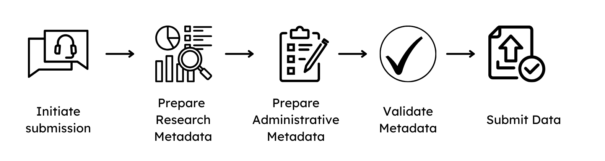

# Research Data File Submission Guide

## 1. Initiation of a submission
To initiate a submission of data to GHGA, please contact us by completing the [pre-submission enquiry](https://www.ghga.de/about-us/presubmission-enquiries), which collects general information about the plannend submission. A GHGA Data Steward will be assigned and guide you through the process, which consists of the following steps:

  { width="800" }

1. Signing of a Data Processing Contract, see [here](dpc_preparation.md).
2. Preparation of the non-personal metadata, see [here](user_docs/user_stories/submission/submitter_guide.md)
3. Research Data File submission

The signing of a DPC has to be finalized before a Data Steward is allowed to interact with the non-personal metadata. Preparation of the metadata and file submission can be done on the submitter side in parallel.


## File upload
To submit Research Data Files to GHGA, the [**GHGA-Connector**](https://github.com/ghga-de/ghga-connector) can be utilized to deposit files in an upload box. A Data Steward creates an upload box for each submission with an appropriate volume and can grant access to verified users in the GHGA Data Portal. Files are encrypted and checksums are calculated on the fly. There is no file preparation required before initiating an upload.

To initiate file deposition to an upload box:

- Register in the [Data Portal](https://data.ghga.de/)
- Verify your account with a valid [IVA](../../other/iva.md)
- Communicate the account (name/email) in your ticket in the [GHGA Helpdesk](mailto:helpdesk@ghga.de)
- Once granted access by a Data Steward, generate an access token for the upload box in your [User Account](https://data.ghga.de/account)
- Start the file deposition in the upload box as outlined in the [**GHGA-Connector Documentation**](user_docs/cli_tools/connector.md)
- Once the submission is complete, click on ```Submit```in the [User Account](https://data.ghga.de/account) to close the box

*Please keep in mind that the file names of the deposited files match the File Name or File Alias in the metadata, so the services can link the entries.*
