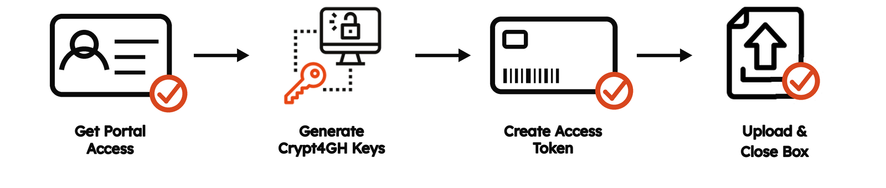

# Research Data File Submission Guide

To submit Research Data Files to GHGA, the [**GHGA Connector**](../../cli_tools/connector.md) is used to deposit files in an upload box. A Data Steward creates an upload box for each submission with an appropriate storage volume and can grant access to verified users in the [GHGA Data Portal](https://data.ghga.de/). Files are encrypted and checksums are calculated on the fly. There is no need to prepare or encrypt files yourself before starting an upload.

  { width="800" }

!!! note "Data Processing Contract"

    A [Data Processing Contract](dpc_preparation.md) has to be signed by all parties before a Data Steward is allowed to generate an upload box and enable the submission of Research Data Files.

## Get Portal Access

1. Register in the [GHGA Data Portal](https://data.ghga.de/) using your <general:LS ID>.
2. Verify your account with a valid <general:Independent Verification Address (IVA)>.
3. Communicate your account (name/email) in a ticket to the <general:GHGA Helpdesk>.

## Generate Crypt4GH Keys

The GHGA Connector uses a [Crypt4GH](https://crypt4gh.readthedocs.io/latest/) keypair to encrypt your files as they are uploaded, just as it does to decrypt files on download. If you don't already have a keypair, generate one as described under [Crypt4GH Keys](../../cli_tools/connector.md#crypt4gh-keys) in the GHGA Connector documentation. Keep your private key safe — only the public key needs to be shared with GHGA.

## Create Access Token

Once a <general:Data Steward> has granted you access to an upload box, generate an access token for it in your [User Account](https://data.ghga.de/account) by clicking **Create Token** in the "Research Data Upload" tab and entering your public Crypt4GH key.

## Upload & Close Box

Start the file deposition as outlined in the [GHGA Connector documentation](../../cli_tools/connector.md#file-upload), which supports two ways to deposit files: a TSV-driven [batch-upload](../../cli_tools/connector.md#1-batch-upload) for depositing many files at once, or an interactive [ubox shell](../../cli_tools/connector.md#2-ubox-upload) for uploading single files and managing the upload box. Once the submission is complete, click **Submit** in the [User Account](https://data.ghga.de/account) to close the box.

!!! warning "Matching file aliases to metadata"

    Each uploaded file's **alias** must exactly match the file alias in your metadata submission, so the two can be linked by the GHGA services. Depending on the upload method, this alias is either set explicitly (the second column of the `batch-upload` TSV) or, unless overridden with `--alias`, defaults to the file name itself (`ubox upload`). Mismatched aliases are a common causes of validation errors — please double-check them before closing the upload box.
