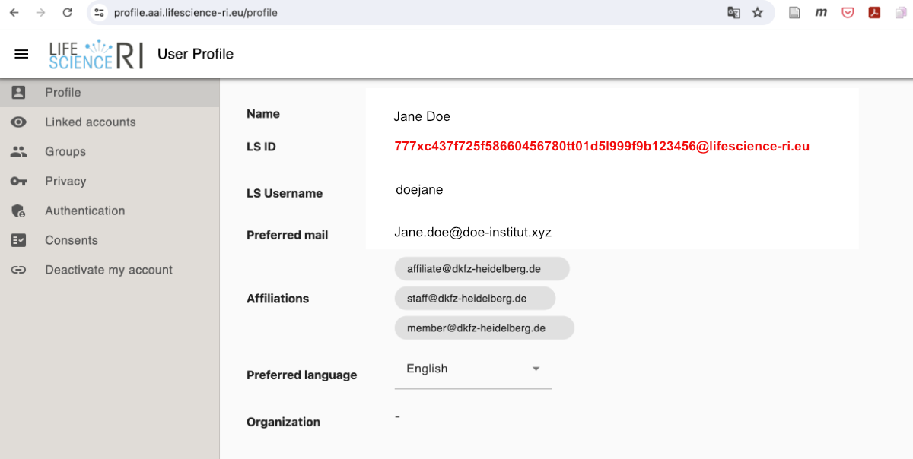

# Preparation of a GHGA Data Processing Contract for submission to GHGA Archive

## Introduction

A <general:Data Processing Contract (DPC)> is signed by <general:GHGA Central> and an institution that is the <general:Research Data Controller (RDC)> when they wish to submit data to GHGA. The DPC sets out how GHGA may process the data, the role of the <general:GHGA Data Hub|GHGA Data Hubs>, and what the Data Controllers’ responsibilities are. 

:octicons-info-24:: The DPC is available [here :octicons-download-24:](https://www.ghga.de/Downloads/GHGA_Data_Processing_Contract.pdf) for download.

The DPC creates a controller-to-processor relationship between the institution and GHGA Central. It has been designed to conform with [Art. 28 GDPR Nr. 3](https://gdpr-info.eu/art-28-gdpr/).

!!! note "The difference between a Data Controller and a Data Submitter"

      The GDPR defines a Data Controller as the party which "determines the purposes and means of the processing of personal data". Within the context of GHGA, we also use the term Data Submitter to mean the person or institution who are submitting Research Data to the GHGA Data Portal. In many cases, the Data Controller and Data Submitter will be the same but this is not always true; it is therefore important for the Data Submitter to check who the Data Controller is for the data they wish to submit. In this guide, we will use the term Data Controller, as it is the Data Controller who is required to sign the GHGA Data Processing Contract.

## The GHGA Data Processing Contract

The DPC is structured in two parts. The first part, comprised of the sections *Preamble* to *§7 - Signing*, focuses on the services that GHGA offers to the Data Controller once they have signed a DPC. The second part of the DPC are the annexes which focus on the data protection aspects that relate to the different data types which are processed under the DPC. There are sections within the annexes for which the Data Controller must provide information.

### Sections of the First Part

A brief summary of these sections is presented below.

*Preamble* - This section introduces GHGA and the objectives of the project.

*§1 - Definitions* - This section defines the specific GHGA-related terms used within the DPC.

*§2 - Purpose of this Agreement* - This sections describes the services that GHGA offers to Data Controllers. These services are:

1.	The storage of Research Data.

2.	The publication of Non-personal Metadata that describes the Research Data in the GHGA Data Portal.

3.	Quality control checks performed upon the Research Data, Personal Metadata, and Non-personal Metadata.

4.	The storage of any Personal Metadata related to the Research Data.

5.	Additional processing of the Research Data to assess and enhance its quality.

6.	Support to make the Research Data and Personal Metadata accessible to approved Data Requesters. 

7.	GHGA Central shall operate a Helpdesk service through which Service Users including the Data Submitter can receive support.

A fuller description of these services is provided in the DPC.

*§3 - Right to Termination* - This section explains in what circumstances the DPC can be terminated. Both parties have the right to cancel the DPC if the other fails to meet their obligations. The Data Controller can also cancel the DPC whenever they wish.

*§4 - Process for the Termination of the Agreement* - This section sets out the process followed in the event that a DPC is cancelled. The data that has been deposited will either be returned to the Data Controller or destroyed depending on the preferences of the Data Controller. If a DPC is cancelled because the Data Controller is unresponsive, GHGA may be forced to destroy the data has been deposited. 

*§5 - Warranties and Liabilities* - This section describes the warranties and liabilities for each party in the event that there are damages resulting from the submission of data. GHGA commits to making a reasonable effort to retreive any data in the event of a loss, but that this effort is limited to what is reasonable for GHGA to do.

*§6 - Final Provisions* - This section includes additional clauses that affect the DPC including how changes to the contract can be made.

*§7 - Signing* - This section is signed by the Data Controller and GHGA Central.

### Annexes

A brief summary of the annexes is presented below.

#### Annex 1 - Research Data Transferred by the the Data Submitter
In Annex 1, the Data Controller is required to list the data or studies that they wish to submit to GHGA, and to provide information about them. This information is used to decide which GHGA Data Hub is best placed to process the submission. Only data or studies which are listed in Annex 1 can be submitted under the DPC. Any future submission will require another DPC. The Data Controller must also provide contact information about how Data Requesters can make a request to access the data. 

#### Annex 2 - GHGA Data Hubs
In Annex 2, GHGA will list all of the institutions that have been fully onboarded as GHGA Data Hubs and will be acting as sub-processors to GHGA Central. The GHGA Data Hubs will be responsible for storing Research Data and Personal Metadata on behalf of GHGA Central. 

#### Annex 3 - Transfer of Research Data and Personal Metadata from the Data Submiter to GHGA Central in Accordance with Article 28 GDPR
Annex 3 utilises the [Standard Contractual Clauses](https://commission.europa.eu/publications/standard-contractual-clauses-controllers-and-processors-eueea_en) developed by the European Commission for controller-to-processor relationships to govern the processing of Research Data and Personal Metadata. The template produced by the European Commission has been adapted to refer to GHGA Central and the GHGA Data Hubs. 

#### Annex 4 - Persons Authorised to Act
Annex 4 asks the Data Controller for persons authorised to act. It is expected that for a majority of submissions to GHGA, an institution rather than an individual scientist will be the Data Controller. It is also expected that the people who represent their institutions, such as a Management Board, Chancellor, or Director, are not likely to be responsible for submitting data to GHGA. As such, we require the Data Controller to name people who can act on their behalf so that we can be sure that the instructions we receive from those people are legally valid.

In order to ensure that only authorised people can access our systems, GHGA utilises [Life Science Login (LS Login)](https://lifescience-ri.eu/ls-login/) to authenticate users. Therefore, the DPC requires the Data Controller to include the LS Login IDs of the persons who they authorise to act. The process for obtaining LS Login IDs is described [below](#specification-of-ls-login-ids-for-usage-in-contracts). 

#### Annex 5 - Processing of Non-personal Metadata
Annex 5 sets out the Data Controller's obligations with regards to the submission of Non-personal Metadata that will be displayed publicly in the GHGA Data Portal. The Data Controller is required to confirm that the metadata they are submitting is non-personal.
 
#### Annex 6 - The Processing of Personal Data to fulfil this Agreement
In order for GHGA to fulfil a Data Processing Contract it will be necessary to process personal Administrative Data, e.g. contact information about people who have been authorised to act on behalf of the Data Controller. Annex 6 describes the processing of personal Administrative Data, the legal basis for doing so, and the rights of the Data Subjects.

## Specification of LS Login IDs for usage in contracts

To be able to process <general:Data Processing Contract (DPC)> and for others uses, GHGA users need to specify details of their LS Login ID to GHGA. The following information is needed:

| Field | Explanation  |
|---|---|
|Name| The name of the person, e.g. `Doe, Jane` |
|Organisation| Name of the Organisation / Institution that interacts with GHGA, e.g. `Doe Institut`|
|Role| Your role in the Organisation, e.g. `Data Steward` |
|Contact Information| An email adress, e.g. `Jane.doe@doe-institut.xyz`|
|Life Science Login ID / LS ID | The LS ID e.g. as displayed in your user profile on https://profile.aai.lifescience-ri.eu/profile, e.g. `777xc437f725f58660456780tt01d5l999f9b123456@lifescience-ri.eu`. See screenshot below.  |

[Profile page](https://profile.aai.lifescience-ri.eu/profile) on LS Login:

