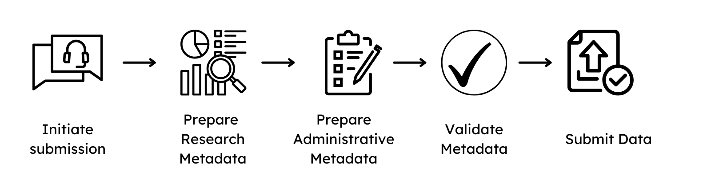
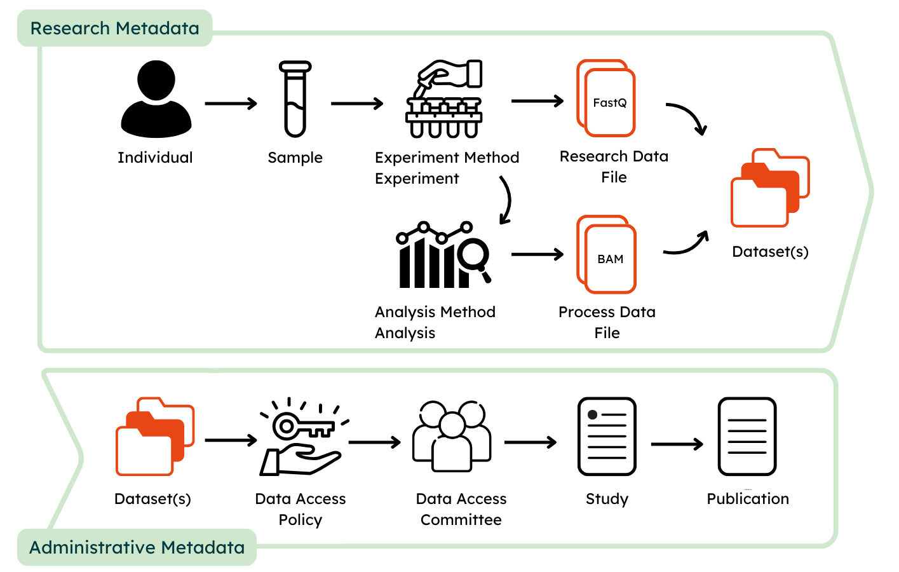
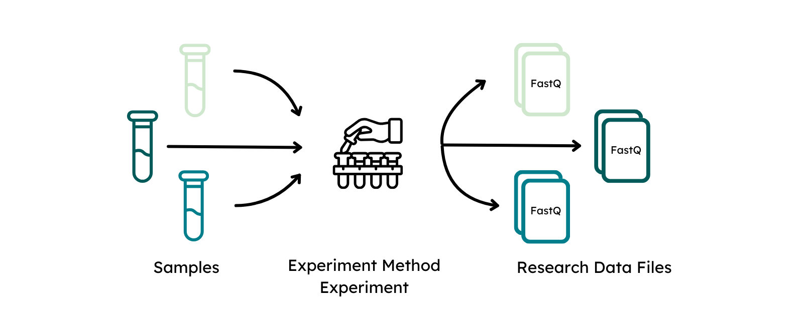
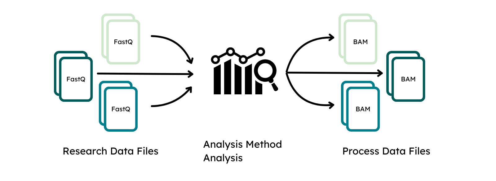
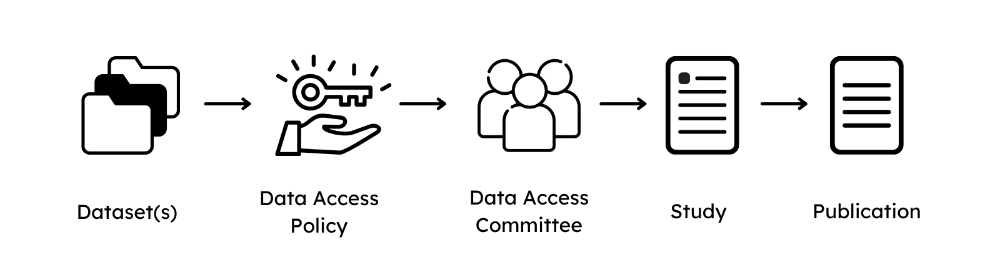

# Data Preparation Guide

## 1. Initiation of a submission
To initiate a submission of data to GHGA, please contact us by completing the [pre-submission enquiry](https://www.ghga.de/about-us/presubmission-enquiries), which collects general information about the plannend submission. A GHGA Data Steward will be assigned and guide you through the process, which consists of the following steps:

  { width="800" }

1. Signing of a Data Processing Contract, see [here](dpc_preparation.md).
2. Preparation of the non-personal metadata
3. Research Data File submission

The signing of a DPC has to be finalized before a Data Steward is allowed to interact with the non-personal metadata. Preparation of the metadata and file submission can be done on the submitter side in parallel.

## 2. Metadata preparation
The GHGA metadata model aims at facilitating comprehensive submissions that maximize the amount of collected metadata in a FAIR manner. Submissions can be either prepared in JSON format or by using a [submission spreadsheet](https://github.com/ghga-de/ghga-metadata-schema/tree/main/spreadsheets). An example submission can be found in our [Github repository containing example data](https://github.com/ghga-de/example-data). The provided metadata are categorized as **Research Metadata** and **Administrative Metadata**, whereas the former collect information about the experimental and data acquisition process and the latter about data access, rights management and disposition. It is crucial, that only non-personal metadata are submitted to GHGA.

  { width="800" }

### Research Metadata
To provide a streamlined submission of metadata, the model is designed to closely resemble a bottom-up-omics experiment:

Similar to an experimental procedure, [**Individuals**](https://docs.ghga.de/metadata/entities/#individual) that are subject to investigation should be defined first. 
In order to describe an individual, data submitters are required to provide information about sex and are recommended to provide information about phenotypic features and diagnoses. 
To maximize the FAIRness of the provided metadata, phenotypic features shoulde be entered using the [Human Phenotype Ontology (HPO)](https://hpo.jax.org/) and diagnosis via [ICD-10](https://www.bfarm.de/EN/Code-systems/Classifications/ICD/ICD-10-WHO/_node.html).

In the next step, the collection of biological material from individuals is described via [**Sample and Biospecimen**](https://docs.ghga.de/metadata/entities/#biospecimensample). Biospecimen is defined in GHGA's metadata as any natural material taken from a biological entity for testing, diagnostics, treatment or research purposes. The sample is linked to the individual and defined as a limited quantity of something to be used for testing, analysis, inspection, investigation, demonstration, or trial use. 

  { width="800" }

The modules [**Experiment**](https://docs.ghga.de/metadata/entities/#experiment) and [**Experiment Method**](https://docs.ghga.de/metadata/entities/#experiment-method) capture information about the protocol that was followed to perform the omics experiment to define the data acquisition process. The experimental method has to be defined once for each different type of experimental setup, e.g. bulk WGS or single cell RNA, whereas an experiment describes the measurement that was performed of a sample with this experimental approach to generate a Research Data File. Therefore, sample and experimental methods are both linked to an experiment.

A [**Research Data File**](https://docs.ghga.de/metadata/entities/#research-data-file) is linked to an experiment as it is defined as the raw output from the data acquisition process. Information about the file format as well as technical replicate should be provided here. Checksum and file size are automatically generated upon file upload and do not need to be specified again. The file alias should match the name of the submitted file to connect the specified metadata to the Research Data File.

  { width="800" }

The classes [**Analysis**](https://docs.ghga.de/metadata/entities/#analysis) and [**Analysis Method**](https://docs.ghga.de/metadata/entities/#analysis-method) function similar to Experiment and its methods to describe the process of data acquisition from a linked Research Data Files by downstream processing. The analysis method has to be provided once for the analytical approach or used workflow, analysis describes the processing that was performed to generate a Process Data File.

[**Process Data Files**](https://docs.ghga.de/metadata/entities/#process-data-file) are the output of an analysis and linked to it. The class functions similar to a Research Data File and requires submitters to define the matching file alias, type and analysis that generated them to link them to the remaining metadata.

  { width="800" }

Additionally, the submitter can embellish the classes with **Supplementary files**, such as [**experimental protocols**](https://docs.ghga.de/metadata/data_dictionary/ExperimentMethodSupportingFile/) for the experiment class, [**workflow parameter files**](https://docs.ghga.de/metadata/data_dictionary/AnalysisMethodSupportingFile/) for the analysis class or [**structured metadata files**](https://docs.ghga.de/metadata/data_dictionary/IndividualSupportingFile/), such as phenopackets or PED files for the individual class. 
Supplementary files are encrypted and inaccessible without an accepted data access request. 
This allows submission of metadata that should not be publicly visible **as it can only be accessed by requesters after the data controller has approved a data transfer request** and the data is made available via the portal to the data requester. Hence, the data portal will only indicate the presence of supplementary files for classes and signify that a submission contains additional information, e.g. in the form of encrypted phenopackets for individuals, but not process or show their content.

### Administrative Metadata
Once the experimental and analytic approach as well as the file generation have been described, the submitter can define the conditions on how to share the data.

  { width="800" }

For this, all submitted file types are linked to and presented in [**Datasets**](https://docs.ghga.de/metadata/entities/#dataset) that allow submitters to provide a high-level description of its content and define under which data use conditions the content of the dataset can be shared by providing [Data Use Ontology (DUO) codes](https://www.ga4gh.org/product/data-use-ontology-duo/). 

Each dataset is managed by a **Data Access Committee** that defines a [**Data Access Policy**](https://docs.ghga.de/metadata/entities/#data-access-policy-and-committee) to describe clear guidelines for data requesters to access the data. The Data Access Committee should consist of multiple members and provide a non-personal mail address that forwards mail to each member of the DAC to decrease the risks of abandoned or unresponsive DACs.

Lastly, a [**Study**](https://docs.ghga.de/metadata/entities/#study) is defined to outline the research intent of the submission. For this, study title, abstract and information about the journal where the study is published (if available) are collected. An alias for the study has to be defined, to link the datasets of the submission. If present, also the [**Publication**](https://docs.ghga.de/metadata/entities/#publication) in which the data is referred can be described.

### Use case examples

The GHGA metadata model enables submitters to represent a wide range of experimental and analytic approaches of omics studies. Different experimental methods require different entities in the classes, whereas only the relevant ones are exposed to the submitter via different spreadsheets. The “core set” of classes in contrast stays immutable and describes approach- agnostic metadata that can be used to describe the general experiment design. The following tables show a set of common use-cases linearized to the long format for the submitted files for better readability:

#### Studies with case/control samples:
[Table 1](https://docs.google.com/spreadsheets/d/10bTG8TwisxZf_tCOlQc0HunXmDKPsvPkqA6rZG766dY/) - Case or control is an entity on the sample level and is linked to files via experiment.

#### Studies with technical and biological replicates

[Table 2](https://docs.google.com/spreadsheets/d/1xiID3i0sIav79DdmffvTHMJ3kAIfo-jBxrywjZ2BwMI) - Biological replicate information can be collected similarly on the sample level, technical replicates on file level.

#### Studies with composition of technical and biological replicates in a time series

[Table 3](https://docs.google.com/spreadsheets/d/12yr8NGENaf6X-Ma5mhTGieoNc-lbzmKTW-9mVhsgbEA) - Different compositions between technical and biological replicates can be encoded on the research data file and sample level. Specific information like time series can be modeled by annotating the samples in name, description and attribute.

#### Study with research data, processed data and supplementary data files

[Table 4](https://docs.google.com/spreadsheets/d/14roP6smAxw5p_mPeMXlC0KUrab8eEIIJj51xb3Q9mzw) - Processed files, such as for alignment and variant calling can be added and additional phenotypic information can be submitted alongside the research data/processed files in form of supplementary files. For individuals, it can be indicated that further supplementary information exists that is accessible upon decryption of data.

The shown examples show only the relevant parts of the metadata model in the long format, linking to samples, experiment, analysis via aliases has been inferred.

## 3. Metadata validation
The GHGA Data Steward assists in case of any questions about the GHGA metadata schema. Once the metadata spreadsheet is finalized, it should be sent to the GHGA Helpdesk. 

To validate the submission, the GHGA Data Steward will use the [**GHGA Transpiler**](https://docs.ghga.de/cli_tools/transpiler/) to generate a JSON of the submission. Should the linkage between entities contain structural or logical issues, they would be identified at this step. 

If a JSON can be generated from the submission, the [**GHGA Validator**](https://docs.ghga.de/cli_tools/validator/) is used to validate the content of the submission. A report is generated that indicates errors issues with the submitted metadata, such as misalignments with controlled vocabularies or ontologies. This report is sent back by the Data Steward with recommendations on how to fix the issues. 

  { width="800" }

Both Validator and Transpiler are publicly available and can be used by the submitter to validate the submission on their end.

## 4. File upload
To submit the research data files to GHGA, the files have to be migrated to a [**GHGA Data Hub**](https://www.ghga.de/about-us/how-we-work/data-hubs). The Data Stewards will assist in this process. Once the files are available at a Data Hub, the files are ingested in the GHGA Archive by the Data Steward using the [**GHGA DataSteward-Kit**](https://github.com/ghga-de/ghga-datasteward-kit). 

## 5. Publication on the Data Portal
Once the files are deposited and the metadata submitted to the GHGA Helpdesk, the submission is finalized but the data is not yet findable on the [**GHGA Data Portal**](https://data.ghga.de/). To make the metadata of the submission publicly findable and allow Data Access Requests to be started for the data, simply notify the GHGA Helpdesk. This will generate stable accessions that can be used to refer to the data deposition at GHGA.

