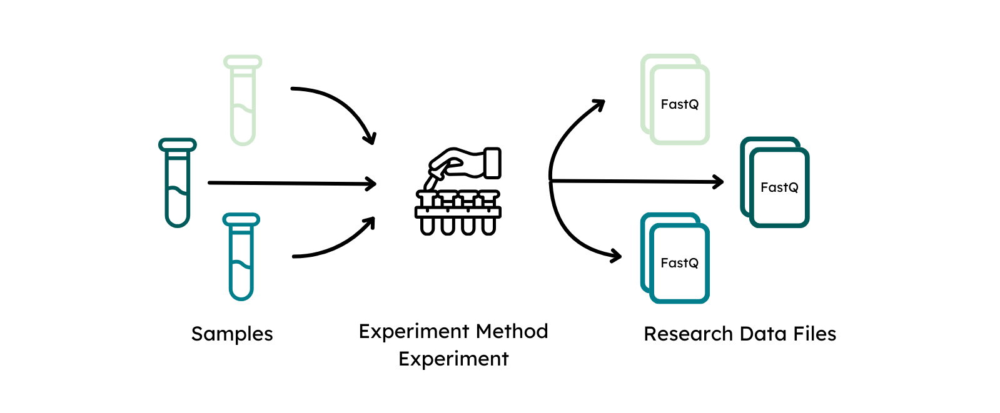
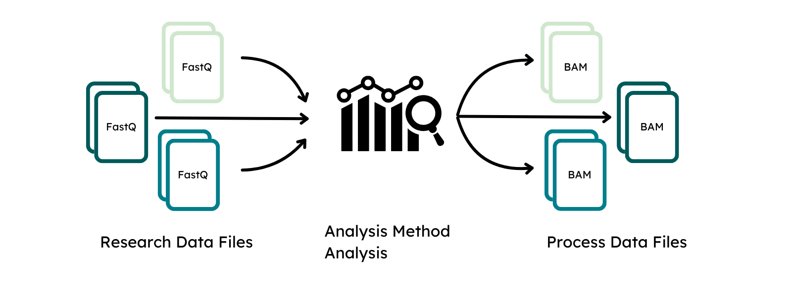
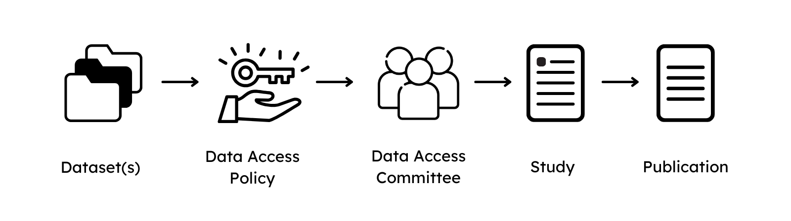

# Metadata Preparation Guide

## 1. Initiation of a Submission
To initiate a submission of data to GHGA, please contact us by completing the [pre-submission enquiry](https://www.ghga.de/about-us/presubmission-enquiries), which collects general information about the planned submission. A GHGA Data Steward will be assigned and guide you through the process, which consists of the following steps:

  { width="800" }

1. Signing of a Data Processing Contract, see [here](dpc_preparation.md).
2. Preparation of the non-personal metadata
3. Research Data File submission, see [here](RDF_submission.md)

The signing of a DPC has to be finalized before a Data Steward is allowed to interact with the non-personal metadata. Preparation of the metadata can be done on the submitter side in parallel.

## 2. Preparing Research and Administrative Metadata
The GHGA metadata model aims at facilitating comprehensive submissions that maximize the amount of collected metadata in a FAIR manner. Submissions can be either prepared in JSON format or by using a [submission spreadsheet](https://github.com/ghga-de/ghga-metadata-schema/tree/main/spreadsheets). An example submission can be found in our [Github repository containing example data](https://github.com/ghga-de/example-data). The provided metadata are categorized as **Research Metadata** and **Administrative Metadata**. The former collects information about the experimental and data acquisition process whereas the latter about data access, rights management and disposition. It is crucial, that only non-personal metadata are submitted to GHGA.

!!! info "Identifiers and quasi-identifiers in the metadata model"
    Identifiers are data elements that are unique to an entity, and can be used to directly identify that entity. For example, a person's name can directly identify them. Within the GHGA metadata model, sample IDs are unique to a Data Subject, and Data Submitters are advised to ensure that any matching file that contains both the sample ID and personal data about the Data Subject is securely held. Quasi-identifiers, by contrast, are attributes that may not identify an individual on their own but could lead to re-identification when used in combination. In the GHGA metadata model, we consider sex, age, diagnosis, phenotypic feature, ancestry, and geographic region to be quasi-identifiers. While the model employs privacy by design, Data Submitters should be aware that rare combinations of quasi-identifiers could lead to re-identification of the Data Subject. It may therefore be necessary to change certain data items when unusual combinations of quasi-identifiers occur, for example by reducing the precision of diagnosis codes.

{ width="800" }

### How Entities Are Linked: Aliases

Every entity you define in the submission spreadsheet — an Individual, a Sample, an Experiment, and so on — is identified by an **alias**: a short, submitter-chosen name that only needs to be unique within your submission. Aliases are what connect entities to one another: for example, a Sample row references the alias of the Individual it was collected from, and an Experiment row references the aliases of the Sample and Experiment Method it uses. The same mechanism links Research Data Files and Process Data Files to the rest of the metadata, and, separately, it is also how the files you upload are matched to their metadata: the file alias must match the actual uploaded file name.

Keeping aliases exactly consistent across all sheets is essential, since mismatched aliases are one of the most common causes of validation errors. It is worth double-checking them before sending a submission to the GHGA Helpdesk. Please also ensure that aliases, especially those identifying a Sample or Individual, do not contain any personal information, for example birth dates, initials or actual names.

### Research Metadata
To provide a streamlined submission of metadata, the model is designed to closely resemble a bottom-up omics experiment:

Similar to an experimental procedure, [**Individuals**](../../metadata/entities.md#individual) that are subject to investigation should be defined first.
In order to describe an individual, data submitters are required to provide information about biological sex and are recommended to provide information about phenotypic features, diagnoses and ancestry.
To maximize the FAIRness of the provided metadata, phenotypic features should be entered using the [Human Phenotype Ontology (HPO)](https://hpo.jax.org/), diagnosis via [ICD-10](https://www.bfarm.de/EN/Code-systems/Classifications/ICD/ICD-10-WHO/_node.html), and ancestry via the [Human Ancestry Ontology (HANCESTRO)](https://obofoundry.org/ontology/hancestro).

In the next step, the collection of biological material from individuals is described via [**Sample and Biospecimen**](../../metadata/entities.md#sample). Biospecimen is defined in GHGA's metadata as any natural material taken from a biological entity for testing, diagnostics, treatment or research purposes. The sample is linked to the individual and defined as a limited quantity of something to be used for testing, analysis, inspection, investigation, demonstration, or trial use. Submitters are required to indicate whether a sample represents a case or a control, and are recommended to specify the anatomical site a biospecimen was taken from using the [BRENDA Tissue Ontology (BTO)](https://obofoundry.org/ontology/bto.html).

  { width="800" }

The modules [**Experiment**](../../metadata/entities.md#experiment) and [**Experiment Method**](../../metadata/entities.md#experiment-method) capture information about the protocol that was followed to perform the omics experiment to define the data acquisition process. The experimental method has to be defined once for each different type of experimental setup, e.g. bulk WGS or single cell RNA, whereas an experiment describes the measurement that was performed of a sample with this experimental approach to generate a Research Data File. Therefore, sample and experimental methods are both linked to an experiment.

A [**Research Data File**](../../metadata/entities.md#research-data-file) is linked to an experiment as it is defined as the raw output from the data acquisition process. Information about the file format as well as technical replicate should be provided here. Checksum and file size are automatically generated upon file upload and do not need to be specified again. The file alias should match the name of the submitted file to connect the specified metadata to the Research Data File.

  { width="800" }

The classes [**Analysis**](../../metadata/entities.md#analysis) and [**Analysis Method**](../../metadata/entities.md#analysis-method) function similar to Experiment and its methods to describe the process of data acquisition from a linked Research Data Files by downstream processing. The analysis method has to be provided once for the analytical approach or used workflow, analysis describes the processing that was performed to generate a Process Data File.

[**Process Data Files**](../../metadata/entities.md#process-data-file) are the output of an analysis and linked to it. The class functions similar to a Research Data File and requires submitters to define the matching file alias, type and analysis that generated them to link them to the remaining metadata.

  { width="800" }

Additionally, the submitter can embellish the classes with **Supplementary files**, such as [**experimental protocols**](../../metadata/data_dictionary/ExperimentMethodSupportingFile.md) for the experiment class, [**workflow parameter files**](../../metadata/data_dictionary/AnalysisMethodSupportingFile.md) for the analysis class or [**structured metadata files**](../../metadata/data_dictionary/IndividualSupportingFile.md), such as phenopackets or PED files for the individual class.
Supplementary files are encrypted and inaccessible without an accepted data access request.
This allows submission of metadata that should not be publicly visible **as it can only be accessed by requesters after the data controller has approved a data transfer request** and the data is made available via the portal to the data requester. Hence, the data portal will only indicate the presence of supplementary files for classes and signify that a submission contains additional information, e.g. in the form of encrypted phenopackets for individuals, but not process or show their content.

### Administrative Metadata
Once the experimental and analytic approach as well as the file generation have been described, the submitter can define the conditions on how to share the data.

  { width="800" }

For this, all submitted file types are linked to and presented in [**Datasets**](../../metadata/entities.md#dataset) that allow submitters to provide a high-level description of its content and define under which data use conditions the content of the dataset can be shared by providing [Data Use Ontology (DUO) codes](https://www.ga4gh.org/product/data-use-ontology-duo/).

Each dataset is managed by a **Data Access Committee** that defines a [**Data Access Policy**](../../metadata/entities.md#data-access-policy-and-committee) to describe clear guidelines for data requesters to access the data. The Data Access Committee should consist of multiple members and provide a non-personal mail address that forwards mail to each member of the DAC to decrease the risks of abandoned or unresponsive DACs.

Lastly, a [**Study**](../../metadata/entities.md#study) is defined to outline the research intent of the submission. For this, study title, abstract and affiliation are collected. An alias for the study has to be defined, to link the datasets of the submission. If present, also the [**Publication**](../../metadata/entities.md#publication) in which the data is referred can be described.

### Writing Meaningful Metadata

Many entities in the model — Samples, Experiments, Studies, and especially Datasets — require a free-text **title** and **description**. These fields are not just for your own records: a Dataset's title and description are shown directly to prospective data requesters browsing the [GHGA Data Portal](https://data.ghga.de/), and every free-text field may later be read by a Data Steward, a Data Access Committee, or another Scientist who was not involved in generating the data. Writing them with that audience in mind makes your data easier to find and understand:

- Avoid lab-internal shorthand, project codenames, or abbreviations that only make sense within your group. Spell out what an outside reader would need to know, e.g. write "Bulk RNA sequencing of resected pancreatic ductal adenocarcinoma tissue, pre-treatment" instead of "PDAC_RNAseq_batch3".
- Be specific about the biological and technical context — tissue, condition, method — rather than generic, so an entry is meaningful without needing to inspect the raw data.
- Where a field has a recommended ontology, as described throughout this page and summarized on the [Standards](../../metadata/standards.md#ontologies) page, use the matching concept term instead of relying on free text fields. This keeps metadata both human-readable and machine-searchable.
- Use the same terminology for the same concept across all entities in a submission, so aliases and descriptions clearly refer to the same thing.

### Use case examples

The GHGA metadata model enables submitters to represent a wide range of experimental and analytic approaches of omics studies. Different experimental methods require different entities in the classes, whereas only the relevant ones are exposed to the submitter via different spreadsheets. The “core set” of classes in contrast stays immutable and describes approach-agnostic metadata that can be used to describe the general experiment design.

A complete example submission, including a filled-in spreadsheet and the resulting transpiled JSON, is available in the [GHGA example-data repository](https://github.com/ghga-de/example-data).

The following tables show a set of common use-cases linearized to the long format for the submitted files for better readability:

#### Studies with case/control samples:
[:material-file-delimited: Table 1](../../assets/example_tables/case_control_samples.xlsx) - Case or control is an entity on the sample level and is linked to files via experiment.

#### Studies with technical and biological replicates

[:material-file-delimited: Table 2](../../assets/example_tables/technical_biological_replicates.xlsx) - Biological replicate information can be collected similarly on the sample level, technical replicates on file level.

#### Studies with composition of technical and biological replicates in a time series

[:material-file-delimited: Table 3](../../assets/example_tables/time_series_replicates.xlsx) - Different compositions between technical and biological replicates can be encoded on the research data file and sample level. Specific information like time series can be modeled by annotating the samples in name, description and attribute.

#### Study with research data, processed data and supplementary data files

[:material-file-delimited: Table 4](../../assets/example_tables/research_processed_supplementary_files.xlsx) - Processed files, such as for alignment and variant calling can be added and additional phenotypic information can be submitted alongside the research data/processed files in form of supplementary files. For individuals, it can be indicated that further supplementary information exists that is accessible upon decryption of data.

The shown examples show only the relevant parts of the metadata model in the long format, linking to samples, experiment, analysis via aliases has been inferred.

## 3. Validate Metadata
Once the metadata spreadsheet is finalized, it should be sent to the GHGA Helpdesk. Alternatively, since both tools are [publicly available](../../cli_tools/cli_overview.md), you can run the [**GHGA Transpiler**](../../cli_tools/transpiler.md) and [**GHGA Validator**](../../cli_tools/validator.md) yourself first and forward us either result:

- If you send the **spreadsheet**, the GHGA Data Steward runs the Transpiler to generate a JSON of the submission and then the Validator to validate its content.
- If you send the already-transpiled **JSON**, the GHGA Data Steward only needs to run the Validator.

The GHGA Data Steward assists in case of any questions about the GHGA metadata schema. Should the linkage between entities contain structural or logical issues, they are identified at the transpilation step. Once a JSON can be generated from the submission, the Validator checks its content and produces a report indicating issues with the submitted metadata, such as misalignments with controlled vocabularies or ontologies. This report is sent back by the Data Steward with recommendations on how to fix the issues.

  { width="800" }

Once the submission passes validation, GHGA generates stable accession identifiers that can be used to reference the data deposited in GHGA.

## 4. Metadata Publication on the Data Portal
Once the files are deposited and the metadata has passed validation, the submission is finalized, but the data is not yet findable on the [**GHGA Data Portal**](https://data.ghga.de/). Publication does not have to happen right away — to make a submission's metadata publicly available and enable Data Access Requests for the associated data, simply notify the GHGA Helpdesk whenever you are ready to do so.
