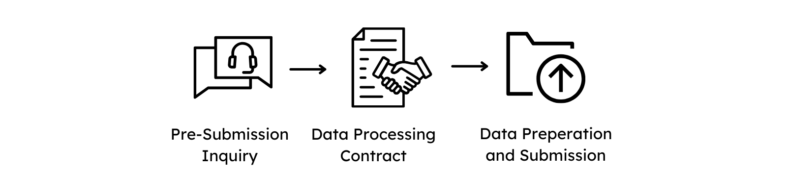

# Submitting Data

A submission of data contains the three main steps, please follow the links for further information:

  { width="800" }

1. Filing a [Pre-Submission Inquiry](https://www.ghga.de/about-us/presubmission-enquiries) or contacting us via the <general:GHGA Helpdesk>
1. [Agreement of a Data Processing Contract with GHGA Central](dpc_preparation.md)
1. [Preparing the Data, including Metadata, for submission](submitter_guide.md)

## Note on Submission Service

--8<-- "submission_limitations.md"

# Submission Guidelines

This GHGA research data submission guideline, focusing on next-generation sequencing (NGS) data, discusses the accepted data types and related metadata model requirements. It is a living document updated periodically to accommodate advancements in high-throughput technologies. Adhering to these guidelines enhances reproducibility in science and promotes adherence to the FAIR (Findable, Accessible, Interoperable, Reusable) principles. Hence, GHGA provides guidelines for submission data types and their related metadata model requirements.

## GHGA's Commitment

1. The GHGA project is committed to enhancing reproducibility in science and promoting adherence to the FAIR principles.
2. Data submitters are thus encouraged to submit the research data as comprehensively as possible.

GHGA accepts research data from human subjects across various data modalities of genomics and transcriptomics experiments (e.g., DNA and RNA sequencing, and epigenetic data). Proteomics data from Mass Spectrometry has planned support but is currently not supported by the GHGA Metadata Model. Accepted raw data formats include, but are not limited to, FASTQ, unaligned BAM/CRAM, and FAST5 for Nanopore. We further accept processed data such as aligned reads in e.g., BAM or CRAM format, variant call sets in VCF format, and RNA expression and protein intensity tables. However, to ensure the implementation of the FAIR principles, these two basic requirements for data submissions should be maintained as rigorously as possible:

1. Although processed data is accepted, submissions should contain raw data as produced by the instrument (e.g., sequencer, mass spectrometer, etc.). 
2. Metadata should follow the metadata schema as described in the [model documentation](https://docs.ghga.de/metadata/overview/) and on [Github](https://github.com/ghga-de/ghga-metadata-schema).

Below are more detailed guidelines for specific accepted and unsupported data modalities.

## Illumina Short-Read-Based Submissions
Data should ideally be provided in CRAM format, including all unmapped reads and associated references.
Alternatively, BAM files, including all unmapped reads and associated references or raw FASTQ files, can be submitted. 
Variant call sets in VCF format are the least preferable for DNA sequencing submissions and should be accompanied by the underlying raw data.

## Nanopore Long-Read-Based Submissions
Due to the evolving nature of Nanopore technology, raw FAST5 or POD5 files should be submitted to allow for base-calling to be redone if necessary.
BAM or CRAM files with unmapped reads and associated references will also be accepted (as in 1a and b). Ideally, suitable metadata about software versioning would be supplied (particularly in reference to base calling and alignment software) so that recovery of raw data is possible.
Variant call sets in VCF format are the least preferable for DNA sequencing submissions.

## Other Data Types
Data types not explicitly described in these guidelines should follow the best practices of their respective research fields.
As a minimum requirement, the submitted format or data type should allow full recovery of the original sequence (that is, a FASTQ file should be recoverable from the data type).
For methodologies and protocols that require supplemental microscopy images (for example, spatial transcriptomics), GHGA will accept this data in the submission.
Spatial transcriptomics data submitted to GHGA will only be accepted as a bundle of both sequencing and image data per sample.

# Supplementary Information
GHGA encourages users to deposit technical information required for re-analysis in applicable repositories such as Dockstore and Zenodo, or as an encrypted supplementary file to the submission.
Auxiliary files, including processed results (counts tables, statistical analysis results, etc.), documentation, processed research data, phenotype data and clinical data (preferably a Phenopackets), and analysis scripts, can be deposited and are encouraged as supplements to the primary research data submission.
All auxiliary files with personal (meta)data, such as clinical phenotypic or metadata. should be submitted as encrypted files using the GA4GH standard Crypt4GH with the GHGA public key.
Auxiliary file submissions without the original matching sequence data are possible, albeit not recommended, and will not be further processed by GHGA or managed and cataloged with full metadata.

## Unsupported Deposits
Incoming data at GHGA will be subject to evaluation. Part of this process will enable the rejection of specific unsupported file types and research data. These are listed below:
GHGA and the GHGA Metadata Model do not support depositing binary executables used to process the data.
Measurements from low-throughput experiments such as RT-qPCR or Sanger sequencing are also unsupported.

## Support-Pending Data Types
In addition to currently supported data, GHGA plans on supporting further data modalities such as mass-spectrometry based proteomics and metabolomics in the future. Right now, the metadata model does not support these submissions. However, when it does, these guidelines should be adhered to:
 Mass Spectrometry Proteomics-Based Submissions
These guidelines have been developed to align, as far as possible, with those recommended by PRIDE.
The raw output of the mass spectrometer should be provided (e.g., .RAW files for Thermo Scientific or Waters instruments, .D files for Agilent instruments).
In addition, matching HUPO Proteomics Standards Initiative (PSI) approved formats for peak files should also be supplied (preferably as mzML format, or mgf files for Mascot).
Results files are also recommended to facilitate complete submissions, either in mzTab (peptide/protein identification information only) or mzIdentML (additional quantification results) formats. 

