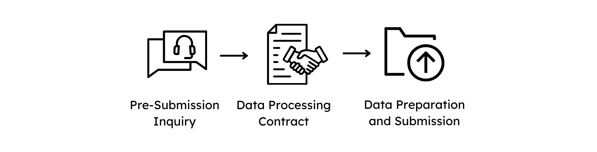

# Submitting Data

A submission of data contains the three main steps, please follow the links for further information:

  { width="800" }

1. Filing a [Pre-Submission Inquiry](https://www.ghga.de/about-us/presubmission-enquiries) or contacting us via the <general:GHGA Helpdesk>
1. [Agreement of a Data Processing Contract with GHGA Central](dpc_preparation.md)
1. [Preparing the Data, including Metadata, for submission](submitter_guide.md)

## Note on Submission Service

--8<-- "submission_limitations.md"

